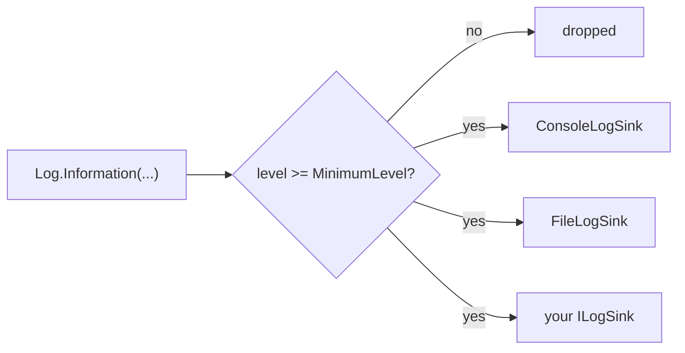

# Diagnostics

Two small facilities in `SharpProspero.Diagnostics` help a module report on itself while it runs: a leveled log that fans messages out to one or more sinks, and a frame-rate tracker that reports the pace a build is holding.

## Logging

`Log` is a static facility: pick a minimum level, add one or more sinks, and write leveled messages. A message below the minimum level, or a message written when no sink is attached, costs almost nothing. Logging never throws, so a failing sink cannot bring the module down.

```csharp
using SharpProspero.Diagnostics;

Log.MinimumLevel = LogLevel.Debug;
Log.AddSink(FileLogSink.Open("/data/app.log"));   // appends lines to a file
Log.AddSink(new ConsoleLogSink());                // and to the development console

Log.Information("started");
Log.Error($"load failed: 0x{code:X8}");
```

Each message runs through the level filter once, then fans out to every attached sink:



The five write methods each carry a level: `Log.Trace`, `Log.Debug`, `Log.Information`, `Log.Warning` and `Log.Error`. There is no `Log.Info` — the information-level method is `Log.Information`. `Log.Write(level, message)` takes the level as an argument when you need to choose it at run time.

{: .note }
> The default `MinimumLevel` is `LogLevel.Information`, so `Trace` and `Debug` lines are dropped until you lower it. `AddSink`, `RemoveSink` and `ClearSinks` manage the destination list.

### Levels

`LogLevel` orders messages from most to least detailed. A message is written only when its level is at or above `MinimumLevel`.

| Level | Meaning |
| --- | --- |
| `Trace` | Fine-grained detail, off by default. |
| `Debug` | Diagnostic detail for development. |
| `Information` | Normal progress. |
| `Warning` | Something unexpected that the module handled. |
| `Error` | A failure. |
| `None` | Set as `MinimumLevel` to turn logging off entirely. |

### Sinks

A sink is a destination for log lines. Implement `ILogSink` to send messages wherever you like — over the network, into an on-screen overlay, into a ring buffer. The single method is `void Write(LogLevel level, string message)`, and an implementation should not throw.

```csharp
public interface ILogSink
{
    void Write(LogLevel level, string message);
}
```

Two sinks come ready to use. `ConsoleLogSink` writes each line to standard output, which appears on the development console when one is attached; it needs no file and no setup, so it is a convenient default while you work. `FileLogSink` appends lines to a file that a user can read back after a run.

```csharp
using SharpProspero.Diagnostics;

var log = FileLogSink.Open("/data/app.log");   // created if absent, opened for append
Log.AddSink(log);
// ... run ...
log.Dispose();                                  // closes the file at shutdown
```

`FileLogSink.Open` creates the file if it is absent and opens it for appending, so a log survives across runs until the file is removed. It throws if the file cannot be opened, and it implements `IDisposable`; dispose it at shutdown to close the file. Every sink formats a line the same way, as `HH:mm:ss.fff LVL message`, where `LVL` is the three-letter tag `TRC`, `DBG`, `INF`, `WRN` or `ERR`. If the real-time clock cannot be read — for example before it is ready early in start-up — the timestamp reads `--:--:--.---` and the rest of the line is unchanged.

## Frame statistics

`FrameStats` tracks how long recent frames took and reports the frame rate and the frame time, so a build can show whether it is holding its pace. Feed it the time since the last frame, then read the figures or draw the readout and a small graph over the screen.

```csharp
using SharpProspero.Diagnostics;

var stats = new FrameStats();          // rolling window of the most recent 120 frames

// each frame:
stats.Record((float)context.DeltaSeconds);
// after drawing the screen:
stats.Draw(surface, 20, 20, scale: 2, Color.White);
stats.DrawGraph(surface, 20, 60, 240, 60, Color.FromRgb(90, 160, 255));
```

The constructor takes an optional `window` (120 frames by default, at least two): the figures follow a rolling window of that many recent frames rather than the whole run. `Record(deltaSeconds)` adds one frame; a zero or negative delta is ignored. `Reset()` clears the window back to empty, and `SampleCount` reports how many frames it currently holds.

`Fps` comes from the mean frame time. `LastMs`, `AvgMs`, `MinMs` and `MaxMs` report the window in milliseconds. Because a mean hides the occasional stutter, two members expose the slow tail: `PercentileMs(95f)` gives the time all but the slowest five percent of frames came in under, and `OnePercentLowFps` turns the ninety-ninth-percentile frame time into a rate — the pace a player feels during the worst frames.

{: .tip }
> Compare `Fps` against `OnePercentLowFps`. A wide gap between the two means the average is smooth but the build is stuttering, which the average alone will not show you.

`Draw` writes a one-line readout to a [2D surface](graphics.md) at a position and scale: the rate, the average frame time and the slowest frame in the window. `DrawGraph` draws a sparkline of the recent frame times, oldest at the left. The top of the box is a 33 ms frame, or the slowest frame in the window when that is slower, so a build holding 60 frames a second draws a flat line across the middle and a stutter spikes to the top; pass an optional border colour to frame it. Both take a `Surface` and colours from `SharpProspero.Graphics`.

## CPU profiler markers

`SharpProspero.Interop.Debug.RazorCpu` binds the CPU profiler entry points so a build can push labelled markers, plot named values against time, drop bookmarks, tag buffers for the data sampler, delimit logical file accesses, and ask whether a host capture is active. `SharpProspero.Interop.Debug.RazorCpuDebug` adds the two capture-control entries, so a build can start or stop a capture from its own code when the host is listening for the command.

```csharp
using SharpProspero.Interop.Debug;

unsafe
{
    fixed (byte* label = "level-load\0"u8)
    {
        RazorCpu.sceRazorCpuPushMarker(label, RazorCpu.ColorGreen, RazorCpu.MarkerPromiseScoped);
        LoadLevel();
        RazorCpu.sceRazorCpuPopMarker();
    }

    fixed (byte* series = "fps\0"u8)
        RazorCpu.sceRazorCpuPlotValue(series, stats.Fps);
}
```

Every marker takes a NUL-terminated UTF-8 label (up to 16,384 bytes including the terminator), an ABGR colour word (the `Color*` constants cover the common eight), and a flag word. `MarkerPromiseScoped` promises the pop matches the push inside the same function so the profiler captures a backtrace for the marker; `MarkerEnableHud` shows the marker in the head-up display. `sceRazorCpuPushMarkerStatic` skips the label copy when the string is static and lives for the whole capture; `sceRazorCpuIsCapturing` reports whether a capture is running so a build can skip marker work on unwatched frames.

Bookmarks and plots share the same shape: `sceRazorCpuWriteBookmark(label, description)` writes a timestamped bookmark with an optional description, and `sceRazorCpuPlotValue(series, value)` adds one point to a named series. `sceRazorCpuSync` and `sceRazorCpuNamedSync` emit frame-boundary events - one unnamed, one with a label - for capture tools that align on frame ticks. `sceRazorCpuFlushOccurred` reports whether an internal buffer flush ran since the last call, and optionally the cycles the flush took.

The data sampler needs backing storage first. `sceRazorCpuGetDataTagStorageSize(tagCount)` returns the byte size a tag table needs for that many entries; hand a buffer of that size (or larger) to `sceRazorCpuInitDataTags`, then attach tags with `sceRazorCpuTagArray` (fixed-size elements) or `sceRazorCpuTagBuffer` (opaque bytes). `sceRazorCpuResizeTaggedBuffer` changes the recorded size, `sceRazorCpuUnTagBuffer` closes a tag, and `sceRazorCpuShutdownDataTags` releases the storage.

`sceRazorCpuBeginLogicalFileAccess(path, tag, size, LogicalFileRead)` opens a logical-file region on the current thread; every subsequent read or write is attributed to the named file until `sceRazorCpuEndLogicalFileAccess` closes it. `sceRazorCpuDisableFiberUserMarkers` switches the marker context from a running fiber to the plain thread when a build does not use the fiber machinery.

`RazorCpuDebug.sceRazorCpuStartCapture` and `sceRazorCpuStopCapture` return zero on success, or `RazorCpuDebug.ErrorHostNotListening` when the host is not currently listening for a start or stop request. Every entry point returns a negative error code on failure, so a build can check `SceResult.Failed(rc)` before continuing.

For the clocks and timers that drive a frame loop, see [Timing](timing.md); to move work that would stall a frame onto another thread, see [Threading](threading.md).
