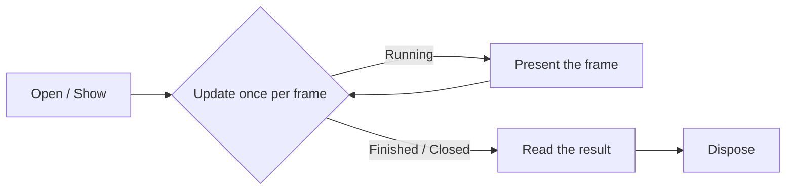

# Dialogs and overlays

The system overlays — message boxes, the error box, the on-screen keyboard, the browser, and the save
picker — draw on top of the running application and are driven from the frame loop: open one, advance
it once per frame while you keep presenting, then read the result and dispose it. The high-level
wrappers for these overlays live in `SharpProspero.Platform`, and the remaining common dialogs — sign
in, login, PlayGo, player invitation, player selection — sit one level down in
`SharpProspero.Interop.Dialog` and are driven the same way. Toast notifications are the exception:
they fire and forget.

<details open markdown="block">
  <summary>On this page</summary>
  {: .text-delta }
- TOC
{:toc}
</details>

## The shared lifecycle

Every overlay dialog on this page follows the same shape. Opening it brings the shared dialog subsystem
up, loads the dialog's own module, and starts the dialog, in that order. From there you call `Update`
once per frame and keep presenting the display, because the dialog only advances when you pump it. When
`Update` reports the dialog has closed, you read its outcome. Disposing shuts the dialog down and unloads
its module, except the browser, which leaves its module loaded. The message, error, keyboard and browser
overlays close the dialog first when it is still open; the save picker leaves that to its shutdown.



{: .important }
> A dialog that you stop updating never closes, and the frame stops presenting, so the whole
> application looks frozen. Keep the `Update` and present calls running until the dialog reports it is
> done, and wrap the object in `using` so it always tears down.

## Message dialogs

`MessageDialog` shows either a message with buttons or a progress bar the application drives. The
progress bar is what a package installer shows while it works.

Drive a progress bar with `SetProgress` (0 to 100), and change its caption at any time with
`SetProgressMessage`:

```csharp
using var progress = MessageDialog.ShowProgress("Installing...");
while (installing)
{
    progress.SetProgress(percentDone);
    progress.Update();
    display.Present();
}
```

Ask a question with `ShowMessage` and a `MessageDialogButtons` value — `Ok`, `YesNo`, or `OkCancel`.
Poll `Update` until it returns `MessageDialogState.Finished`, then read `ChosenButton`:

```csharp
using var ask = MessageDialog.ShowMessage("Delete this file?", MessageDialogButtons.YesNo);
while (ask.Update() == MessageDialogState.Running)
    display.Present();
bool yes = ask.ChosenButton == MsgDialogButtonId.Ok;   // OK and Yes share the first button
```

`ChosenButton` is a `MsgDialogButtonId` (from `SharpProspero.Interop.Dialog`); its `Ok` value is the
first button, which stands in for both OK and Yes, and `No` is the second. `MessageDialogState` has just
two members, `Running` and `Finished`.

| Member | What it does |
|---|---|
| `ShowMessage(text, buttons, userId)` | Open a message with a button set and wait for a choice. |
| `ShowProgress(caption, userId)` | Open a progress bar the application drives. |
| `SetProgress(percent)` | Move the bar to 0-100 (clamped). |
| `SetProgressMessage(message)` | Replace the caption shown with the bar. |
| `Update()` | Advance the dialog and report `Running` or `Finished`. |
| `ChosenButton` | The button the user picked, once finished. |

## Error dialogs

`ErrorDialog` presents the console's own message for an error code, so a utility reports a failure the
way the system does rather than inventing its own wording. Show it for the code, then poll until it
closes.

```csharp
using var dialog = ErrorDialog.Show(errorCode);
while (dialog.Update() != ErrorDialogState.Closed)
    display.Present();
```

`Show` takes the integer error code and an optional user id. `Update` returns
`ErrorDialogState.Running` or `ErrorDialogState.Closed`.

## Text input

`TextInputDialog` shows the on-screen keyboard and hands back what the user typed. This is the input
surface a file explorer, browser, or any interactive utility needs to let the user type. Open it, poll
until it closes, then read the text.

```csharp
using var input = TextInputDialog.Open("Enter a name", maxLength: 64);
while (input.Update() == TextInputState.Running)
    display.Present();
if (input.EndStatus == ImeDialogEndStatus.Ok)
    Use(input.Text);
```

`Open` centres the keyboard on screen. `maxLength` runs from 1 to 2048 characters and defaults to 128.
Pass an `ImeType` to choose the layout (`Url` for a web address, and so on), a `placeholder` hint, an
`initialText` value, or an `ImeOption` — `Password` masks the field, and `Multiline`,
`NoAutoCapitalization`, `ExternalKeyboard`, `NoLearning`, `FixedPosition` and `DisableCopyPaste` shape
the rest of its behaviour. Poll `Update` until it returns
`TextInputState.Finished`, then check `EndStatus`: `ImeDialogEndStatus.Ok` means the user accepted the
text, which `Text` then returns. `Text` is empty until the keyboard finishes and empty when the user
cancelled. Defaulting `userId` picks the signed-in user.

{: .tip }
> A key on a USB keyboard is a position, not a letter. To read typed characters directly from a
> physical keyboard instead of the on-screen one, see the keyboard input surface and its keycode
> converter under [Input](input.md).

## The web browser

`WebBrowser` opens the system browser over the running application. Open it for an address, then poll
until it closes.

```csharp
using var browser = WebBrowser.Open("https://example.com");
while (browser.Update() != WebBrowserState.Closed)
    display.Present();
int result = browser.Result();
```

`Update` returns `WebBrowserState.Running` or `WebBrowserState.Closed`. Once closed, `Result` reads the
browser's result code and throws when it cannot be read. `Open` takes the URL and an optional user id;
left unnamed, it opens for the user the console started with. The browser matches the id against the
signed-in users, so the system profile is refused — pass a real user id or none at all.

### Allow-listed content

For a browser that should only reach a known set of addresses,
`WebBrowserDialog.sceWebBrowserDialogOpenForPredeterminedContent` opens the dialog against a
`WebBrowserDialogPredeterminedContentParam` holding up to twenty null-terminated addresses. Fill the
block through `InitializePredeterminedContentParam` so the size field is set, point each `Domain`
slot at the address the browser is allowed to reach (leave unused slots null), and open the dialog:

```csharp
using var module = SystemModule.Load(SystemModuleId.WebBrowserDialog);
CommonDialog.EnsureInitialized();
SceResult.ThrowIfFailed(WebBrowserDialog.sceWebBrowserDialogInitialize(),
    nameof(WebBrowserDialog.sceWebBrowserDialogInitialize));
try
{
    WebBrowserDialogParam param;
    WebBrowserDialog.InitializeParam(&param);
    param.Mode = WebBrowserDialogMode.Default;
    param.UserId = userId;
    param.Url = urlUtf8;

    WebBrowserDialogPredeterminedContentParam allowed;
    WebBrowserDialog.InitializePredeterminedContentParam(&allowed);
    allowed.Domain[0] = (ulong)domain0Utf8;
    allowed.Domain[1] = (ulong)domain1Utf8;

    SceResult.ThrowIfFailed(
        WebBrowserDialog.sceWebBrowserDialogOpenForPredeterminedContent(&param, &allowed),
        nameof(WebBrowserDialog.sceWebBrowserDialogOpenForPredeterminedContent));
    // ... pump sceWebBrowserDialogUpdateStatus until Finished, then read the result ...
}
finally
{
    WebBrowserDialog.sceWebBrowserDialogClose();
    WebBrowserDialog.sceWebBrowserDialogTerminate();
}
```

This variant skips the parental-control check the ordinary `sceWebBrowserDialogOpen` performs.

### Cookies

Two calls control the browser dialog's session cookie store:

| Call | What it does |
|---|---|
| `sceWebBrowserDialogSetCookie(WebBrowserDialogSetCookieParam*)` | Adds one cookie. The block's `Url` points at the address the cookie belongs to, and `Cookie` at the cookie string, both null-terminated. |
| `sceWebBrowserDialogResetCookie(WebBrowserDialogResetCookieParam*)` | Clears every cookie the dialog has stored for the current session. |

Fill each block through its `Initialize...` helper — `InitializeSetCookieParam` or
`InitializeResetCookieParam` — so the size field carries the value the service checks. Both calls run
with the browser subsystem already brought up.

```csharp
WebBrowserDialogSetCookieParam set;
WebBrowserDialog.InitializeSetCookieParam(&set);
set.Url = originUtf8;
set.Cookie = cookieUtf8;
SceResult.ThrowIfFailed(WebBrowserDialog.sceWebBrowserDialogSetCookie(&set),
    nameof(WebBrowserDialog.sceWebBrowserDialogSetCookie));
```

To clear the store:

```csharp
WebBrowserDialogResetCookieParam reset;
WebBrowserDialog.InitializeResetCookieParam(&reset);
SceResult.ThrowIfFailed(WebBrowserDialog.sceWebBrowserDialogResetCookie(&reset),
    nameof(WebBrowserDialog.sceWebBrowserDialogResetCookie));
```

## The save picker

`SaveDataPicker` shows the on-screen list of a user's saves so the player can pick one, and reports
which they chose. It reads a bit differently from the others: poll `TryGetResult`, which returns
`false` while the dialog is still running and `true` once it finishes, setting the chosen directory (or
null when the user backed out).

```csharp
using var picker = SaveDataPicker.OpenList(userId);
while (!picker.TryGetResult(out string? directory))
    display.Present();
if (directory is not null)
    Mount(directory);
```

`OpenList` takes the user id and a `SaveDataDialogType` (defaulting to `Load`; `Save` and `Delete`
change the wording). The `Status` property exposes the underlying `CommonDialogStatus` if you would
rather watch the state directly. This picker only chooses a save; mounting the chosen directory and
reading its files is the programmatic side covered in [Save data](save-data.md).

## The save-data dialog service

`SaveDataPicker` covers the list mode. The remaining modes — a user message, a system-prepared
message, an error code, and a progress bar the caller drives — go through
`SharpProspero.Interop.Dialog.SaveDataDialog` directly. `SaveDataDialogMode` lists the modes
(`List`, `UserMessage`, `SystemMessage`, `ErrorCode`, `ProgressBar`, `WizardList`, `WizardConfirm`),
`SaveDataDialogType` picks the wording (`Save`, `Load`, `Delete`), and `SaveDataDialogButtonType`
picks the button set (`Ok`, `YesNo`, `None`, `OkCancel`). A system-message dialog reads its wording
from `SaveDataDialogSystemMessageType`, which covers cases like `NoData`, `Overwrite`, `NoSpace` and
`Finished`.

Build a `SceSaveDataDialogParam` through `SaveDataDialog.InitializeParam`; the helper clears the
whole block, sets its size, and derives the check value from its own address, all of which the
service inspects. Open the dialog with `sceSaveDataDialogOpen`, pump `sceSaveDataDialogUpdateStatus`
each frame, read the outcome from `sceSaveDataDialogGetResult` once it reports `Finished`, and shut
it down with `sceSaveDataDialogClose` (taking a `SceSaveDataDialogCloseParam` that names the closing
animation).

`sceSaveDataDialogIsReadyToDisplay` reports whether the service is ready to open a new dialog on top
of what is already on screen — a useful pre-flight for a title that opens dialogs in reaction to
another one closing.

### Driving a progress bar

The progress-bar mode is the shape a background save or an install shows. Once the dialog is open,
two calls change what the bar reads:

| Call | What it does |
|---|---|
| `sceSaveDataDialogProgressBarInc(target, delta)` | Advances the bar by `delta` percentage points on the bar identified by `target`. |
| `sceSaveDataDialogProgressBarSetValue(target, rate)` | Sets the bar to `rate` percentage points on the bar identified by `target`. |

Pass `SaveDataDialog.ProgressBarTargetBarDefault` for the dialog's default bar. Both calls report a
negative error code when the dialog is not in progress-bar mode or has not yet reached its running
state.

## Sign-in and login dialogs

Two related overlays put a signed-out user through the sign-in flow. The login dialog offers a list
of users to choose from; the signin dialog runs the flow for one named user. Both live in
`SharpProspero.Interop.Dialog` and share the same shape: initialize the service, build a parameter
block through the `InitializeParam` helper, open the dialog, pump `sceLoginDialogUpdateStatus` (or
its signin counterpart) each frame, read the result once it reports `Finished`, and shut the service
down.

### The login dialog

`LoginDialog` opens the picker that lists users the caller can sign in. `LoginDialogMode` chooses
which set to offer — `AllUsers` for every user on the console, or `NotLoggedInUsersOnly` for only
those who are signed out. The exclude lists (`ExcludeUsersFromLoginList` and
`ExcludeUsersFromLogoutList`) hide chosen users from the sign-in and sign-out lists respectively;
`InitializeParam` seeds every entry with `SceUser.Invalid` so a caller that wants no exclusions gets
none — a raw-zero exclude entry would refer to a real signed-in user. `InitialFocus` sets which
user the dialog highlights on open.

```csharp
SceResult.ThrowIfFailed(LoginDialog.sceLoginDialogInitialize(),
    nameof(LoginDialog.sceLoginDialogInitialize));
try
{
    SceLoginDialogParam param;
    LoginDialog.InitializeParam(&param);
    param.Mode = LoginDialogMode.NotLoggedInUsersOnly;

    SceResult.ThrowIfFailed(LoginDialog.sceLoginDialogOpen(&param),
        nameof(LoginDialog.sceLoginDialogOpen));

    while (LoginDialog.sceLoginDialogUpdateStatus() != LoginDialogStatus.Finished)
        display.Present();

    SceLoginDialogResult result;
    SceResult.ThrowIfFailed(LoginDialog.sceLoginDialogGetResult(&result),
        nameof(LoginDialog.sceLoginDialogGetResult));

    if (result.Result == LoginDialogResultType.Ok)
        Use(result.SelectedUser);
}
finally
{
    LoginDialog.sceLoginDialogClose();
    LoginDialog.sceLoginDialogTerminate();
}
```

`LoginDialog.MaxLoginUsers` (4) is the largest number of exclusion entries either list holds.
`sceLoginDialogGetStatus` reads the status without advancing it — helpful for a check that must not
tick the dialog.

### The signin dialog

`SigninDialog` runs the sign-in flow for one named user. `SceSigninDialogParam.UserId` names that
user, and `InitializeParam` seeds it with `SceUser.Invalid` so a caller has to name a real signed-out
profile rather than accidentally addressing the first signed-in one:

```csharp
SceResult.ThrowIfFailed(SigninDialog.sceSigninDialogInitialize(),
    nameof(SigninDialog.sceSigninDialogInitialize));
try
{
    SceSigninDialogParam param;
    SigninDialog.InitializeParam(&param);
    param.UserId = userId;

    SceResult.ThrowIfFailed(SigninDialog.sceSigninDialogOpen(&param),
        nameof(SigninDialog.sceSigninDialogOpen));

    while (SigninDialog.sceSigninDialogUpdateStatus() != SigninDialogStatus.Finished)
        display.Present();

    SceSigninDialogResult result;
    SceResult.ThrowIfFailed(SigninDialog.sceSigninDialogGetResult(&result),
        nameof(SigninDialog.sceSigninDialogGetResult));

    if (result.Result == SigninDialogResultType.Ok)
        Confirmed();
}
finally
{
    SigninDialog.sceSigninDialogClose();
    SigninDialog.sceSigninDialogTerminate();
}
```

Both dialogs share their status enum shape (`None`, `Initialized`, `Running`, `Finished`) and their
result-type enum shape (`Ok`, `UserCanceled`).

## The PlayGo dialog

`PlayGoDialog` presents three related overlays for a title that streams its chunks in the background:
a progress bar over one or several chunk lists, a disc-change prompt, and an install-request prompt
for an optional chunk. The dialog runs on top of an open PlayGo handle. `PlayGoDialogMode` picks
between them, `PlayGoDialogProgressBarType` chooses between one caption over one chunk list
(`SingleChunkList`) or one caption per row (`EnumeratedChunkList`), and
`PlayGoDialogDiscChangeType.LanguageMask` names a disc-change prompt that asks for a disc carrying
one of the named language masks.

`InitializeParam` clears the block, fills its sizes, and derives the check value from its own
address. Fill in the fields for the mode, then open, pump, and shut down like the other common
dialogs:

```csharp
ScePlayGoDialogParam param;
PlayGoDialog.InitializeParam(&param);
param.Handle = playGoHandle;
param.Mode = PlayGoDialogMode.ProgressBar;
param.ProgBarParam = &progressBarParam;

SceResult.ThrowIfFailed(PlayGoDialog.scePlayGoDialogInitialize(),
    nameof(PlayGoDialog.scePlayGoDialogInitialize));
try
{
    SceResult.ThrowIfFailed(PlayGoDialog.scePlayGoDialogOpen(&param),
        nameof(PlayGoDialog.scePlayGoDialogOpen));

    while (PlayGoDialog.scePlayGoDialogUpdateStatus() != CommonDialogStatus.Finished)
        display.Present();

    ScePlayGoDialogResult result;
    SceResult.ThrowIfFailed(PlayGoDialog.scePlayGoDialogGetResult(&result),
        nameof(PlayGoDialog.scePlayGoDialogGetResult));

    if (result.Result == PlayGoDialog.ResultAutoClosed)
        SystemClosed();
}
finally
{
    PlayGoDialog.scePlayGoDialogClose();
    PlayGoDialog.scePlayGoDialogTerminate();
}
```

`ScePlayGoDialogResult.Result` is zero for confirmation, one for cancel, and
`PlayGoDialog.ResultAutoClosed` (3) when the system closed the dialog on the caller's behalf. The
constants `MessageSize`, `ChunkListItemLabelSize` and `ChunkListItemMax` cap the string lengths and
row counts a progress-bar dialog can carry.

## The player invitation dialog

`PlayerInvitationDialog` lets a signed-in user send an invitation to their Player session.
`PlayerInvitationDialogMode.Send` is the only presentation the service currently accepts, and
`InitializeParam` sets the mode to `Invalid` so a caller has to choose it explicitly. The session id
carried in `ScePlayerInvitationDialogSendParam.SessionId` is a null-terminated address whose bytes,
with the terminator, fit in `PlayerInvitationDialog.SessionIdMaxSize` (45).

```csharp
ScePlayerInvitationDialogParam param;
PlayerInvitationDialog.InitializeParam(&param);
param.UserId = userId;
param.Mode = PlayerInvitationDialogMode.Send;
param.SendParam = &sendParam;
sendParam.SessionId = sessionIdUtf8;

SceResult.ThrowIfFailed(PlayerInvitationDialog.scePlayerInvitationDialogInitialize(),
    nameof(PlayerInvitationDialog.scePlayerInvitationDialogInitialize));
try
{
    SceResult.ThrowIfFailed(PlayerInvitationDialog.scePlayerInvitationDialogOpen(&param),
        nameof(PlayerInvitationDialog.scePlayerInvitationDialogOpen));

    while (PlayerInvitationDialog.scePlayerInvitationDialogUpdateStatus() != CommonDialogStatus.Finished)
        display.Present();

    ScePlayerInvitationDialogResult result;
    SceResult.ThrowIfFailed(PlayerInvitationDialog.scePlayerInvitationDialogGetResult(&result),
        nameof(PlayerInvitationDialog.scePlayerInvitationDialogGetResult));

    bool sent = result.Result == CommonDialogResult.Ok;
}
finally
{
    PlayerInvitationDialog.scePlayerInvitationDialogClose();
    PlayerInvitationDialog.scePlayerInvitationDialogTerminate();
}
```

`ScePlayerInvitationDialogResult.ErrorCode` carries the service's termination code, and `Result` is
either `CommonDialogResult.Ok` (the user confirmed the send) or `CommonDialogResult.UserCanceled`.

## The player selection dialog

`PlayerSelectionDialog` lets a signed-in user pick friends from their friend list — the surface a
title uses to choose players for a match or a party. `MaxSelectable` caps how many the user can pick,
up to `PlayerSelectionDialog.MaxSelectableSize` (256). The initial state list
(`InitialPlayerStatusList`) seeds the tiles: each `ScePlayerSelectionDialogInitialPlayerStatus` names
an account id, whether the tile starts selected (`PlayerSelectionDialogPlayerSelectStatus`), whether
the user can change it (`PlayerSelectionDialogPlayerEnableStatus`), and which label the tile shows
(`PlayerSelectionDialogPlayerLabel`: `None`, `CantSelect` or `Joined`). The list can hold up to
`PlayerSelectionDialog.MaxPlayerListSize` (256) entries, or be left null for all-default tiles.

`PlayerSelectionDialogBehaviorOption` steers the dialog with two flags that combine as a bit set:
`DisableBlockedPlayer` prevents blocklisted players being picked, and
`EnableDoneButtonWhenNoOneSelected` keeps Done live even when nothing is chosen. The title text
lives in the `DialogTitle` field as UTF-8 bytes with a NUL terminator, capped at
`PlayerSelectionDialog.MaxTitleSize` (64 bytes including the terminator).

```csharp
ScePlayerSelectionDialogParam param;
PlayerSelectionDialog.InitializeParam(&param);
param.UserId = userId;
param.BehaviorOptions = PlayerSelectionDialogBehaviorOption.DisableBlockedPlayer;
param.MaxSelectable = 4;
Encoding.UTF8.GetBytes("Pick your squad", new Span<byte>(param.DialogTitle, PlayerSelectionDialog.MaxTitleSize - 1));

SceResult.ThrowIfFailed(PlayerSelectionDialog.scePlayerSelectionDialogInitialize(),
    nameof(PlayerSelectionDialog.scePlayerSelectionDialogInitialize));
try
{
    SceResult.ThrowIfFailed(PlayerSelectionDialog.scePlayerSelectionDialogOpen(&param),
        nameof(PlayerSelectionDialog.scePlayerSelectionDialogOpen));

    while (PlayerSelectionDialog.scePlayerSelectionDialogUpdateStatus() != CommonDialogStatus.Finished)
        display.Present();

    ScePlayerSelectionDialogResult result;
    SceResult.ThrowIfFailed(PlayerSelectionDialog.scePlayerSelectionDialogGetResult(&result),
        nameof(PlayerSelectionDialog.scePlayerSelectionDialogGetResult));

    if (result.UserAction == CommonDialogResult.Ok)
        for (uint i = 0; i < result.PlayerListLength; i++)
            Add(result.PlayerList[i]);
}
finally
{
    PlayerSelectionDialog.scePlayerSelectionDialogClose();
    PlayerSelectionDialog.scePlayerSelectionDialogTerminate();
}
```

{: .important }
> `ScePlayerSelectionDialogResult.PlayerList` points into memory the service owns until the dialog is
> closed. Read the account ids before calling `scePlayerSelectionDialogClose`; the pointer is not
> valid after that.

## Notifications

`Notification` shows the on-screen toast that slides in at the top of the screen — to confirm a copy,
report a finished install, or show a short message. It is a static call with no lifecycle to pump.

```csharp
Notification.Show("Installed successfully.");
```

The message has to fit what a single request holds: 1023 bytes of UTF-8, which is fewer than 1023
characters for anything outside ASCII. Text that does not fit raises `ArgumentException`, and a refused
request raises `ProsperoException`. `Notification` also drives the persistent banner shown beside the
system button. That banner stays up until you take it down, so it suits a background task that should
stay visible while it runs:

```csharp
Notification.ShowPsButtonBanner();   // optional JSON config: ShowPsButtonBanner("{...}")
// ... work continues, banner stays on screen ...
Notification.HidePsButtonBanner();
```

{: .note }
> `Notification.Show` returns immediately and needs no frame-loop pumping, unlike the overlay dialogs
> above. Pass it a JSON string to `ShowPsButtonBanner` to configure the banner, or nothing for the
> default.

Whether any of these overlays is available depends on what the running module is permitted to do; see
the [System services](system-services.md) overview for the permission notes.
