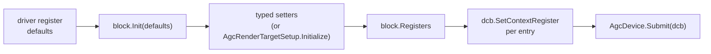

# GPU command layer

The Agc layer drives the graphics processor directly: you describe shader resources and pipeline state as small register blocks, record them into a command buffer, and submit the buffer for the GPU to run. Everything on this page lives in `SharpProspero.Graphics.Agc`.

{: .note }
> This is the shader-based path, for meshes, custom shaders, depth buffering, and blending. Most applications draw with the CPU [Surface](graphics.md) instead and never touch a single type here. Reach for this layer only when you are writing a renderer.

<details open markdown="block">
  <summary>On this page</summary>
  {: .text-delta }
- TOC
{:toc}
</details>

## The two layers

The GPU is exposed as two layers. The lower one is the complete command interface: `SceAgc` holds the command builders (draws, dispatches, register writes, synchronization, shader create and link) and `SceAgcDriver` holds the driver calls (submit, queue, flip, wait). Every builder takes the command buffer first and returns the address of the packet it wrote.

The higher layer wraps that for everyday use:

- `DrawCommandBuffer` records commands into GPU-readable memory. `Allocate` hands back a ready buffer; `Reset` clears the recording for the next frame; the record calls cover register writes, index state, draws, synchronization, and the present calls. `SubmitSizeDwords` is what a submit sends, `RemainingDwords` what is left of `CapacityDwords`. A record call that will not fit returns a null packet address instead of overrunning, and `WaitUntilSafeForDisplay` throws `InvalidOperationException` when there is no room for its packet - size the buffer for a whole frame.
- `AgcShader` builds a shader from its compiled binary. Shaders are compiled ahead of time; the runtime only loads them.
- `AgcDevice` does the one-time `Initialize`, submits a buffer with `Submit`, and closes the frame with `SuspendPoint`.
- `AgcFormats` holds the surface-format and channel-select enumerations.

A frame waits for the display to release a buffer, records state and draws, queues the flip, submits, and closes:

```csharp
using var display = DisplayDevice.Open(1920, 1080);
int videoOutHandle = display.OutputHandle;   // a handle of zero matches no display, and the wait is then left out of the recording

AgcDevice.Initialize();
using var dcb = DrawCommandBuffer.Allocate(1 << 20);

// ... per frame:
uint backBuffer = (uint)display.CurrentBufferIndex;   // rotates with every frame
dcb.Reset();
dcb.WaitUntilSafeForDisplay(videoOutHandle, backBuffer);
// record register blocks and draws (see below)
dcb.SetFlip(videoOutHandle, (int)backBuffer);
AgcDevice.Submit(dcb);
AgcDevice.SuspendPoint();
display.AdvanceFrame();
```

## Register blocks

Pipeline state reaches the GPU as context registers. A single register is a `CxRegister` - an offset and a 32-bit value:

```csharp
public struct CxRegister
{
    public ushort Offset;
    public uint Value;
}
```

The typed blocks (`CxRenderTarget`, `CxBlendControl`, and the rest) group the registers for one piece of state and give you a setter per field, so you never pack bits by hand. They all follow the same rhythm. The register offsets and reset values are not baked into the SDK - they come from the graphics driver at runtime - so you load them into the block with `Init` first, then apply setters, then write the block's `Registers` into the command buffer, one `SetContextRegister` call per entry.

`RegisterDefaults` produces those values. `RenderTargetBlock()` returns the sixteen-entry color
render-target block ready for `CxRenderTarget.Init`. For the one-register blocks, `GetContextValue(offset)`
returns the reset value of a single context register; pair it with that register's offset in a `CxRegister`
to hand to `Init`.



Writing a block into the buffer is always the same loop:

```csharp
foreach (CxRegister reg in block.Registers)
    dcb.SetContextRegister(reg.Offset, reg.Value);
```

Blocks that address one of the eight hardware render-target slots expose `SetSlot`, which shifts the offsets to target that slot; call it after `Init`.

## Render-target registers

`CxRenderTarget` is the sixteen-register color-target block, with typed setters and getters for every field - format, channel type and order, dimensions, tiling, the color and metadata addresses, and the blend and rounding behavior. You rarely set those one at a time. `AgcRenderTargetSetup.Initialize` fills the whole block from a `RenderTargetSpec`, applying the same setup the graphics core does, including the blend, clamp, and rounding modes it derives from the channel type:

```csharp
// The sixteen driver reset values for a color target, ready for Init.
CxRegister[] defaults = RegisterDefaults.RenderTargetBlock();
var rt = new CxRenderTarget().Init(defaults);
AgcRenderTargetSetup.Initialize(rt, new RenderTargetSpec(
    CxRenderTarget.Format.k8_8_8_8,
    CxRenderTarget.ChannelType.kUNorm,
    CxRenderTarget.ChannelOrder.kAlt,   // a display framebuffer carries blue first
    width: 1920, height: 1080,
    dataAddress: gpuColorAddress));

foreach (CxRegister reg in rt.Registers)
    dcb.SetContextRegister(reg.Offset, reg.Value);
```

The channel order has to match the byte order of the buffer the target points at. A display framebuffer carries blue first, so it takes `kAlt`; `kStandard` puts what the shader exported as red into the byte the output reads as blue, exchanging the two with nothing reporting a fault. `kReversed` and `kAltReversed` are those same two orders read back to front. `Renderer3D` sets `kAlt` for this reason.

`CxDepthRenderTarget` is the companion sixteen-register block for a depth and stencil buffer: the same shape, with setters for the depth and stencil formats, dimensions, clear values, HTILE acceleration, and the read, write, and HTILE addresses, loaded from the driver defaults with `Init`.

## Blending

`CxBlendControl` is the one-register blend-control block for a render-target slot: whether blending is on, the source and destination multipliers and the combine function for color and alpha, and whether alpha uses its own equation. Standard alpha blending is source-alpha over one-minus-source-alpha:

```csharp
var blend = new CxBlendControl().Init(defaults);
blend.SetSlot(0)
     .SetBlend(CxBlendControl.Blend.kEnable)
     .SetColorSourceMultiplier(CxBlendControl.ColorSourceMultiplier.kSrcAlpha)
     .SetColorDestMultiplier(CxBlendControl.ColorDestMultiplier.kOneMinusSrcAlpha)
     .SetColorBlendFunc(CxBlendControl.ColorBlendFunc.kAdd);

foreach (CxRegister reg in blend.Registers)
    dcb.SetContextRegister(reg.Offset, reg.Value);
```

`CxBlendColor` is the constant blend color the `kConstantColor` and `kConstantAlpha` multipliers reference - four floating-point components set with `SetRed`, `SetGreen`, `SetBlue`, and `SetAlpha`.

## Depth and stencil

`CxDepthStencilControl` is the one-register test-control block: whether the depth test and depth write are on and the comparison to use, and whether the stencil test is on with its front- and back-face comparisons.

```csharp
var ds = new CxDepthStencilControl().Init(defaults);
ds.SetDepth(CxDepthStencilControl.Depth.kEnable)
  .SetDepthWrite(CxDepthStencilControl.DepthWrite.kEnable)
  .SetDepthFunction(CxDepthStencilControl.DepthFunction.kLessEqual);

foreach (CxRegister reg in ds.Registers)
    dcb.SetContextRegister(reg.Offset, reg.Value);
```

The stencil state fans out into three more one-register blocks: `CxStencilControl` carries the test value, compare mask, write mask, and operation value for front-facing primitives, `CxStencilControlBackFace` the same for back faces, and `CxStencilOpControl` the operations applied on stencil fail, depth-stencil pass, and depth fail for both faces. Each follows the same `Init`-then-set-then-record pattern.

## Viewport and scissor

`AgcViewport` maps the clip-space cube the vertex shader outputs onto a pixel rectangle of the render target and clips anything outside a pixel rectangle. Without it, nothing maps clip space to pixels and nothing is clipped. Set the rectangle, depth range, and scissor, then record the fourteen context registers it produces:

```csharp
var vp = new AgcViewport();
vp.SetViewport(0, 0, 1920, 1080);
vp.SetScissor(0, 0, 1920, 1080);

Span<CxRegister> regs = stackalloc CxRegister[AgcViewport.RegisterCount];
int count = vp.WriteTo(regs);
for (int i = 0; i < count; i++)
    dcb.SetContextRegister(regs[i].Offset, regs[i].Value);
```

The vertical scale is negated for you, so a positive height maps clip space with y pointing up onto a target whose rows count downward from the top. This covers the single-viewport case that scan-out rendering uses.

## Texture and sampler descriptors

To sample a texture in a shader you describe it to the GPU as two small descriptors and point a shader slot at each.

`AgcTextureDescriptor` builds the eight-word image descriptor (a "T#"): where the pixels are, the surface size and format, how its channels map to red-green-blue-alpha, and the mip and array ranges. Build one for an image already laid out in tiled memory, then write its words into GPU-readable memory:

```csharp
var tex = new AgcTextureDescriptor();
tex.SetType(AgcImageType.Texture2D);
tex.SetBaseAddress(gpuTextureAddress);
tex.SetFormat((uint)AgcFormats.TypedFormat.k8_8_8_8UNorm);
tex.SetDimensions(1024, 1024);
tex.SetChannelOrder(AgcChannelSource.Red, AgcChannelSource.Green, AgcChannelSource.Blue, AgcChannelSource.Alpha);
tex.SetTilingIndex((int)AgcTileMode.RenderTarget);

Span<uint> imageWords = stackalloc uint[AgcTextureDescriptor.WordCount];
tex.WriteTo(imageWords);
```

`SetMipRange` only narrows which levels a shader may sample. `SetMipLevelCount` is what tells the
processor how far the chain runs, and it has no default worth relying on: leave it unset and the surface
reads as holding one level, which puts the address of every level below the first in the wrong place.

```csharp
tex.SetMipLevelCount(mipCount);          // one to fifteen
tex.SetMipRange(baseLevel, lastLevel);   // which of them the shader may read
```

A multi-sampled surface uses `SetFragmentCount` instead of a mip chain; an array or volume texture adds
`SetDepthOrSlices` and `SetArrayRange`; and a compressed surface adds `SetMetadataAddress` (which must be
a multiple of 256) together with `SetMetadataEnabled`.

`AgcSamplerDescriptor` builds the four-word sampler descriptor (an "S#"): how coordinates wrap, which filters apply for magnification, minification, between mip levels and across volume slices, the level-of-detail range and bias, anisotropy, an optional depth comparison for shadows, and the border color, along with the finer controls (secondary bias, filter reduction, anisotropy tuning, forced sRGB). Start from `AgcSamplerDescriptor.Create()`, which matches the hardware's own starting state — coordinates wrap, the full mip range is available, and mip and slice sampling are point — then set only what differs. Prefer it over `default`, whose all-zero mip range clamps sampling to the base level.

```csharp
var samp = AgcSamplerDescriptor.Create();
samp.SetAddressModes(AgcAddressMode.ClampToEdge, AgcAddressMode.ClampToEdge, AgcAddressMode.ClampToEdge);
samp.SetFilter(AgcFilter.Bilinear, AgcFilter.Bilinear, AgcMipFilter.Linear);
samp.SetLodRange(0f, 15f);

Span<uint> samplerWords = stackalloc uint[AgcSamplerDescriptor.WordCount];
samp.WriteTo(samplerWords);
```

The texture descriptor addresses memory in 256-byte units - both its pixel address and its compression address are stored shifted right by eight - and the sampler descriptor's level-of-detail values are fixed point, which the float setters convert for you. Both pack each field into the exact bits the hardware reads, and both are value types: copy the written words to where the shader can reach them.

## Buffer descriptors

A shader reaches a buffer through `AgcBufferDescriptor`, four words carrying the address, the record size, and the record count. `Constant(address, sizeInBytes)` describes a constant buffer, where a vertex program reads its transform matrices; `Structured(address, strideInBytes, elementCount)` describes an array the program indexes, usually vertices. The stride must be under 16384 bytes.

The words go into the shader's user data at the slot the program declares. `TryGetResourceSlot` reports that slot as a dword offset from `AgcShader.GsUserDataBaseOffset`, and the four words occupy four consecutive shader registers from there:

```csharp
AgcBufferDescriptor constants = AgcBufferDescriptor.Constant(gpuConstantAddress, 128);
AgcBufferDescriptor vertices = AgcBufferDescriptor.Structured(gpuVertexAddress, stride, vertexCount);

Span<uint> words = stackalloc uint[4];
constants.WriteTo(words);

if (vs.TryGetResourceSlot(ShaderResourceKind.ConstantBuffer, 0, out int dword, out _))
{
    for (uint i = 0; i < 4; i++)
        dcb.SetShaderRegister(AgcShader.GsUserDataBaseOffset + (uint)dword + i, words[(int)i]);
}
```

`Renderer3D` binds its constants and vertices this way each frame, so the 3D path needs none of this; it is for a custom shader.

## Surface layout

Before a render target, depth buffer, or texture exists, you size and align its memory. `AgcSurface.Compute` gives the full layout for any tile mode - total size, base alignment, block dimensions, and per-mip offsets - computed the way the graphics address library computes it:

```csharp
AgcSurfaceLayout layout = AgcSurface.Compute(new AgcSurfaceDescription(
    AgcTileMode.RenderTarget, AgcSurfaceDimension.TwoD,
    width: 1920, height: 1080, bytesPerElement: 4));

using var mem = DirectMemoryRegion.Allocate((nuint)layout.TotalSizeBytes, layout.BaseAlignBytes);
```

`AgcTileMode.RenderTarget` is the tiling the display accepts and the one to give a color target; `AgcTileMode.Depth` is the depth-target tiling; `AgcTileMode.Linear` is plain row-major storage. Direct memory is the only source of GPU-visible buffers - see [Memory](memory.md). For a linear surface where you want just the padded row pitch and size, `LinearSurface.Compute` is the simpler arithmetic-only helper.

## Pixel tiling

The GPU does not read pixels in row-major order; it reads them swizzled into blocks. `AgcTiler` moves pixel bytes between plain linear order and that hardware-tiled order - to upload a texture you built in memory, or to read a rendered surface back into a linear image. `LinearSizeBytes` sizes the linear side, and `Tile` / `Detile` convert one mip level of one slice:

```csharp
var desc = new AgcSurfaceDescription(
    AgcTileMode.RenderTarget, AgcSurfaceDimension.TwoD,
    width: 512, height: 512, bytesPerElement: 4);

var linear = new byte[AgcTiler.LinearSizeBytes(desc)];   // fill with your image
var tiled = new byte[AgcSurface.Compute(desc).TotalSizeBytes];
AgcTiler.Tile(tiled, linear, desc);                      // now upload `tiled` to GPU memory
```

The tiled byte offset of element $(x, y)$ in a two-dimensional target is the block it falls in, times the block size, plus its swizzled position within that block:

$$
\text{offset} = \big(b_y \cdot W_b + b_x\big)\,S_{\text{block}} + e(x, y),
\qquad b_x = \left\lfloor \frac{x}{w_b} \right\rfloor,\quad b_y = \left\lfloor \frac{y}{h_b} \right\rfloor
$$

where $w_b \times h_b$ is the block in elements (`BlockWidth`, `BlockHeight`), $W_b$ is the target width in blocks, $S_{\text{block}}$ is the block size in bytes, and $e(x, y)$ is the within-block element offset the address equation produces. `Detile` runs the same mapping in reverse. Optimal textures - as opposed to render and depth targets - are built ahead of time by the texture tool, the same offline model as shaders.

## Formats

`AgcFormats` is the reference for the format and swizzle enumerations. `ChannelLayout` gives the bit widths per element, `ChannelType` gives how those bits are read (unorm, snorm, uint, sint, srgb, float), `TypedFormat` pairs a layout with an interpretation, and `ChannelSelect` names which source channel or constant a destination channel reads. The render-target block carries its own `CxRenderTarget.Format`, `CxRenderTarget.ChannelType`, and `CxRenderTarget.ChannelOrder` enums for the color-target register fields.

## Building a texture file

Textures are prepared ahead of time into GNF files - a header, a texture descriptor, and the pixel data
in the layout the graphics processor samples. The toolchain's `gnf` command turns a PNG, TGA, BMP, or QOI
image into a GNF with a single linear four-channel texture:

```
dotnet run --project tools/SharpProspero.Bindings.Generator -- gnf --input art/icon.png --output art/icon.gnf
```

Add `--srgb` to mark the colour channels as sRGB (the alpha stays linear); `--resize WxH` scales the image
first (bilinear), so an oversized source becomes a texture-friendly size; `--info <file.gnf>` reports a
GNF's header and its first texture. The result is the file an application loads and points a
`AgcTextureDescriptor` slot at to sample. The build is independent of the SDK, so it runs on any machine
with the toolchain.

## Drawing a 3D mesh

Above the register layer there is a high-level path for geometry. `Renderer3D` draws a mesh with the
built-in mesh shaders: give it a display, then each frame a mesh, a model-view-projection matrix, and the
model matrix that orients its normals. `DrawMesh` records the draw, queues the flip, and advances the
display, so it presents the frame as well - call it once per frame, and do not also call the display's
`Present`. This path covers one mesh per frame; drawing more means recording your own command buffer. The
constructor's `commandBufferBytes` sizes the per-frame recording buffer, 256 KB by default.

```csharp
using System.Numerics;
using SharpProspero.Graphics;
using SharpProspero.Graphics.Agc;
using SharpProspero.Numerics;

using var display = DisplayDevice.Open(1920, 1080);
using var renderer = new Renderer3D(display);
using var cube = MeshBuffer.Upload(MeshData.Cube(1.5f, Color.FromRgb(0x4A, 0x9E, 0xFF)));

var camera = new Camera3D { Position = new Vector3(0, 1.5f, 4.5f), Target = Vector3.Zero, AspectRatio = 1920f / 1080f };
float angle = 0f;
while (running)
{
    angle += 0.02f;
    Matrix4x4 model = Matrix4x4.CreateRotationY(angle);
    renderer.DrawMesh(cube, model * camera.ViewProjection, model);
}
```

`MeshData` builds cube, sphere, plane, and quad geometry, or takes your own vertices and indices;
`MeshBuffer.Upload` places it in graphics memory. `Camera3D` (in `SharpProspero.Numerics`) gives the
view and projection matrices, with `Transform`, `Ray`, `BoundingBox`, `BoundingSphere`, and `Frustum`
alongside it for placing, picking, and culling. The `prospero-3d` sample is a running example.

{: .note }
> The built-in mesh shaders are compiled ahead of time and embedded; `BuiltInShaders.MeshVertex()` and
> `MeshPixel()` return them, so a 3D application needs no shader tooling of its own. For a shader of your
> own, `ShaderBinary.Load(bytes)` reads the header and microcode out of the compiled container,
> `Prepare()` places the code in graphics-readable memory and returns a `PreparedShader`, and its
> `Shader` property is the `AgcShader` the command buffer binds. Dispose the `PreparedShader` once no
> frame in flight still uses it.

## Inspecting a shader binary

The `shader` command reports a compiled shader binary: its kind, version, header and code sizes, and the
register writes it carries. It reads the header, so it needs no graphics device.

```
dotnet run --project tools/SharpProspero.Bindings.Generator -- shader --file mesh_ps.sb
```

Add `--registers` to list every context and shader register the program sets. This inspects a shader; it
does not compile or disassemble one.

## Related pages

- [2D scenes](graphics-scene.md) - cameras, tile maps, and particles on the CPU surface.
- [Graphics](graphics.md) - the CPU `Surface` most applications draw with.
- [Memory](memory.md) - `DirectMemoryRegion`, the source of every GPU-visible buffer.
