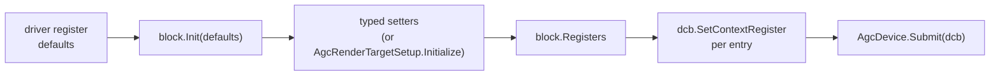

# GPU command layer

The Agc layer drives the graphics processor directly: you describe shader resources and pipeline state as small register blocks, record them into a command buffer, and submit the buffer for the GPU to run. Everything on this page lives in `SharpProspero.Graphics.Agc`.

{: .note }
> This is the shader-based path, for meshes, custom shaders, depth buffering, and blending. Most applications draw with the CPU [Surface](graphics.md) instead and never touch a single type here. Reach for this layer only when you are writing a renderer.

<details open markdown="block">
  <summary>On this page</summary>
  {: .text-delta }
- TOC
{:toc}
</details>

## The two layers

The GPU is exposed as two layers. The lower one is the complete command interface: `SceAgc` holds the command builders (draws, dispatches, register writes, synchronization, shader create and link) and `SceAgcDriver` holds the driver calls (submit, queue, flip, wait). Every builder takes the command buffer first and returns the address of the packet it wrote. Both classes carry the full function surface the platform publishes: every builder has its paired `GetSize` call so a caller can reserve room before recording, and every driver call the module exposes is available for a renderer that needs a submission point the higher layer does not wrap.

The higher layer wraps that for everyday use:

- `DrawCommandBuffer` records commands into GPU-readable memory. `Allocate` hands back a ready buffer; `Reset` clears the recording for the next frame; the record calls cover register writes, index state, draws, synchronization, and the present calls. `SubmitSizeDwords` is what a submit sends, `RemainingDwords` what is left of `CapacityDwords`. A record call that will not fit returns a null packet address instead of overrunning, and `WaitUntilSafeForDisplay` throws `InvalidOperationException` when there is no room for its packet - size the buffer for a whole frame.
- `AgcShader` builds a shader from its compiled binary. Shaders are compiled ahead of time; the runtime only loads them.
- `AgcDevice` does the one-time `Initialize`, submits a buffer with `Submit`, and closes the frame with `SuspendPoint`.
- `AgcFormats` holds the surface-format and channel-select enumerations.

A frame waits for the display to release a buffer, records state and draws, queues the flip, submits, and closes:

```csharp
using var display = DisplayDevice.Open(1920, 1080);
int videoOutHandle = display.OutputHandle;   // a handle of zero matches no display, and the wait is then left out of the recording

AgcDevice.Initialize();
using var dcb = DrawCommandBuffer.Allocate(1 << 20);

// ... per frame:
uint backBuffer = (uint)display.CurrentBufferIndex;   // rotates with every frame
dcb.Reset();
dcb.WaitUntilSafeForDisplay(videoOutHandle, backBuffer);
// record register blocks and draws (see below)
dcb.SetFlip(videoOutHandle, (int)backBuffer);
AgcDevice.Submit(dcb);
AgcDevice.SuspendPoint();
display.AdvanceFrame();
```

## Display bindings

The display service beneath `DisplayDevice` is fully available for a renderer that opens the output and registers buffers itself. `SharpProspero.Interop.VideoOut.VideoOut` publishes the full surface: `sceVideoOutOpen`, `sceVideoOutSetBufferAttribute2`, `sceVideoOutRegisterBuffers2`, `sceVideoOutUnregisterBuffers`, `sceVideoOutSubmitFlip`, `sceVideoOutWaitVblank`, `sceVideoOutIsFlipPending`, `sceVideoOutGetFlipStatus`, `sceVideoOutGetVblankStatus`, the flip / vblank / pre-vblank event registration and removal, the output-mode configure and query pair, `sceVideoOutGetOutputStatus`, the master / slave flip tie, `sceVideoOutSubmitChangeBufferAttribute2`, the buffer-attribute option add / remove, alpha and blend-space control, and the sized colour and colour-space-conversion helpers (`AdjustColor`, `AdjustColorSpaceConversion` and their setters, which pass the caller-owned block size for you).

`SharpProspero.Interop.VideoOut.VideoOutTypes` carries the values every one of those calls takes. `VideoOutLimits` names the register-count, buffer-count, flip-rate and buffer-index sentinels, plus the version constants the primary and flat-panel-display parameter blocks require. The enumerated tokens cover event ids (`VideoOutEventId.Flip`, `Vblank`, `PreVblankStart`), output resolution and dynamic range (`VideoOutOutputResolution`, `VideoOutOutputDynamicRange`), status flags (`VideoOutOutputStatusFlags`, `VideoOutVblankStatusFlags`), global-alpha and blend-space modes (`VideoOutGlobalAlphaMode`, `VideoOutGlobalBlendSpace`), refresh rates (`VideoOutRefreshRate`) and DCC-control ratios (`VideoOutDccControl`).

The pixel-format catalogue is `VideoOutPixelFormat`:

| Format | Layout | Transfer |
|---|---|---|
| `Rgba8Srgb` | 32-bit RGBA | sRGB |
| `Bgra8Srgb` | 32-bit BGRA | sRGB (the CPU-renderer default) |
| `Rgb10A2` / `Bgr10A2` | 10:10:10:2 | Linear |
| `Rgb10A2Srgb` / `Bgr10A2Srgb` | 10:10:10:2 | sRGB |
| `Rgb10A2Bt2100Pq` / `Bgr10A2Bt2100Pq` | 10:10:10:2 | BT.2100 PQ (HDR) |
| `Rgba16Float` / `Bgra16Float` | 16-bit-per-channel float | Linear |
| `Rgba16FloatForBt2100Pq` / `Bgra16FloatForBt2100Pq` | 16-bit-per-channel float | BT.2100 PQ working space |

`VideoOutBufferAttributeOption` covers the option bits: `None`, `StrictColorimetry` (bit 3), and the alpha-premultiplied trio (`AlphaNonPremultiplied` and `AlphaPremultiplied` on bit 5, plus `AlphaPremultipliedMask`), with a `Mask` that covers every exposed option. `VideoOutOutputMode` gives the mode tokens `Unknown`, `Default`, and `Mode119_88Hz` that `sceVideoOutConfigureOutput` accepts. `SceVideoOutParamPrimary` (88 bytes) and `SceVideoOutParamFpd` (32 bytes) are the parameter blocks a caller passes to `sceVideoOutOpen` when it wants to set the display service thread's priority and CPU affinity for that handle; the primary block's version is `VideoOutLimits.ParamPrimaryVersion` and the flat-panel-display block's is `VideoOutLimits.ParamFpdVersion`.

## Register blocks

Pipeline state reaches the GPU as context registers. A single register is a `CxRegister` - an offset and a 32-bit value:

```csharp
public struct CxRegister
{
    public ushort Offset;
    public uint Value;
}
```

The typed blocks (`CxRenderTarget`, `CxBlendControl`, and the rest) group the registers for one piece of state and give you a setter per field, so you never pack bits by hand. They all follow the same rhythm. The register offsets and reset values are not baked into the SDK - they come from the graphics driver at runtime - so you load them into the block with `Init` first, then apply setters, then write the block's `Registers` into the command buffer, one `SetContextRegister` call per entry.

`RegisterDefaults` produces those values. `RenderTargetBlock()` returns the sixteen-entry color
render-target block ready for `CxRenderTarget.Init`. For the one-register blocks, `GetContextValue(offset)`
returns the reset value of a single context register; pair it with that register's offset in a `CxRegister`
to hand to `Init`.


```mermaid
flowchart LR
  D["driver register<br/>defaults"] --> I["block.Init(defaults)"]
  I --> S["typed setters<br/>(or AgcRenderTargetSetup.Initialize)"]
  S --> R["block.Registers"]
  R --> W["dcb.SetContextRegister<br/>per entry"]
  W --> Sub["AgcDevice.Submit(dcb)"]
```

Writing a block into the buffer is always the same loop:

```csharp
foreach (CxRegister reg in block.Registers)
    dcb.SetContextRegister(reg.Offset, reg.Value);
```

Blocks that address one of the eight hardware render-target slots expose `SetSlot`, which shifts the offsets to target that slot; call it after `Init`.

## Render-target registers

`CxRenderTarget` is the sixteen-register color-target block, with typed setters and getters for every field - format, channel type and order, dimensions, tiling, the color and metadata addresses, and the blend and rounding behavior. You rarely set those one at a time. `AgcRenderTargetSetup.Initialize` fills the whole block from a `RenderTargetSpec`, applying the same setup the graphics core does, including the blend, clamp, and rounding modes it derives from the channel type:

```csharp
// The sixteen driver reset values for a color target, ready for Init.
CxRegister[] defaults = RegisterDefaults.RenderTargetBlock();
var rt = new CxRenderTarget().Init(defaults);
AgcRenderTargetSetup.Initialize(rt, new RenderTargetSpec(
    CxRenderTarget.Format.k8_8_8_8,
    CxRenderTarget.ChannelType.kUNorm,
    CxRenderTarget.ChannelOrder.kAlt,   // a display framebuffer carries blue first
    width: 1920, height: 1080,
    dataAddress: gpuColorAddress));

foreach (CxRegister reg in rt.Registers)
    dcb.SetContextRegister(reg.Offset, reg.Value);
```

The channel order has to match the byte order of the buffer the target points at. A display framebuffer carries blue first, so it takes `kAlt`; `kStandard` puts what the shader exported as red into the byte the output reads as blue, exchanging the two with nothing reporting a fault. `kReversed` and `kAltReversed` are those same two orders read back to front. `Renderer3D` sets `kAlt` for this reason.

`CxDepthRenderTarget` is the companion sixteen-register block for a depth and stencil buffer: the same shape, with setters for the depth and stencil formats, dimensions, clear values, HTILE acceleration, and the read, write, and HTILE addresses, loaded from the driver defaults with `Init`.

## Blending

`CxBlendControl` is the one-register blend-control block for a render-target slot: whether blending is on, the source and destination multipliers and the combine function for color and alpha, and whether alpha uses its own equation. Standard alpha blending is source-alpha over one-minus-source-alpha:

```csharp
var blend = new CxBlendControl().Init(defaults);
blend.SetSlot(0)
     .SetBlend(CxBlendControl.Blend.kEnable)
     .SetColorSourceMultiplier(CxBlendControl.ColorSourceMultiplier.kSrcAlpha)
     .SetColorDestMultiplier(CxBlendControl.ColorDestMultiplier.kOneMinusSrcAlpha)
     .SetColorBlendFunc(CxBlendControl.ColorBlendFunc.kAdd);

foreach (CxRegister reg in blend.Registers)
    dcb.SetContextRegister(reg.Offset, reg.Value);
```

`CxBlendColor` is the constant blend color the `kConstantColor` and `kConstantAlpha` multipliers reference - four floating-point components set with `SetRed`, `SetGreen`, `SetBlue`, and `SetAlpha`.

## Depth and stencil

`CxDepthStencilControl` is the one-register test-control block: whether the depth test and depth write are on and the comparison to use, and whether the stencil test is on with its front- and back-face comparisons.

```csharp
var ds = new CxDepthStencilControl().Init(defaults);
ds.SetDepth(CxDepthStencilControl.Depth.kEnable)
  .SetDepthWrite(CxDepthStencilControl.DepthWrite.kEnable)
  .SetDepthFunction(CxDepthStencilControl.DepthFunction.kLessEqual);

foreach (CxRegister reg in ds.Registers)
    dcb.SetContextRegister(reg.Offset, reg.Value);
```

The stencil state fans out into three more one-register blocks: `CxStencilControl` carries the test value, compare mask, write mask, and operation value for front-facing primitives, `CxStencilControlBackFace` the same for back faces, and `CxStencilOpControl` the operations applied on stencil fail, depth-stencil pass, and depth fail for both faces. Each follows the same `Init`-then-set-then-record pattern.

## Viewport and scissor

`AgcViewport` maps the clip-space cube the vertex shader outputs onto a pixel rectangle of the render target and clips anything outside a pixel rectangle. Without it, nothing maps clip space to pixels and nothing is clipped. Set the rectangle, depth range, and scissor, then record the fourteen context registers it produces:

```csharp
var vp = new AgcViewport();
vp.SetViewport(0, 0, 1920, 1080);
vp.SetScissor(0, 0, 1920, 1080);

Span<CxRegister> regs = stackalloc CxRegister[AgcViewport.RegisterCount];
int count = vp.WriteTo(regs);
for (int i = 0; i < count; i++)
    dcb.SetContextRegister(regs[i].Offset, regs[i].Value);
```

The vertical scale is negated for you, so a positive height maps clip space with y pointing up onto a target whose rows count downward from the top. This covers the single-viewport case that scan-out rendering uses.

## Texture and sampler descriptors

To sample a texture in a shader you describe it to the GPU as two small descriptors and point a shader slot at each.

`AgcTextureDescriptor` builds the eight-word image descriptor (a "T#"): where the pixels are, the surface size and format, how its channels map to red-green-blue-alpha, and the mip and array ranges. Build one for an image already laid out in tiled memory, then write its words into GPU-readable memory:

```csharp
var tex = new AgcTextureDescriptor();
tex.SetType(AgcImageType.Texture2D);
tex.SetBaseAddress(gpuTextureAddress);
tex.SetFormat((uint)AgcFormats.TypedFormat.k8_8_8_8UNorm);
tex.SetDimensions(1024, 1024);
tex.SetChannelOrder(AgcChannelSource.Red, AgcChannelSource.Green, AgcChannelSource.Blue, AgcChannelSource.Alpha);
tex.SetTilingIndex((int)AgcTileMode.RenderTarget);

Span<uint> imageWords = stackalloc uint[AgcTextureDescriptor.WordCount];
tex.WriteTo(imageWords);
```

`SetMipRange` only narrows which levels a shader may sample. `SetMipLevelCount` is what tells the
processor how far the chain runs, and it has no default worth relying on: leave it unset and the surface
reads as holding one level, which puts the address of every level below the first in the wrong place.

```csharp
tex.SetMipLevelCount(mipCount);          // one to fifteen
tex.SetMipRange(baseLevel, lastLevel);   // which of them the shader may read
```

A multi-sampled surface uses `SetFragmentCount` instead of a mip chain; an array or volume texture adds
`SetDepthOrSlices` and `SetArrayRange`; and a compressed surface adds `SetMetadataAddress` (which must be
a multiple of 256) together with `SetMetadataEnabled`.

`AgcSamplerDescriptor` builds the four-word sampler descriptor (an "S#"): how coordinates wrap, which filters apply for magnification, minification, between mip levels and across volume slices, the level-of-detail range and bias, anisotropy, an optional depth comparison for shadows, and the border color, along with the finer controls (secondary bias, filter reduction, anisotropy tuning, forced sRGB). Start from `AgcSamplerDescriptor.Create()`, which matches the hardware's own starting state — coordinates wrap, the full mip range is available, and mip and slice sampling are point — then set only what differs. Prefer it over `default`, whose all-zero mip range clamps sampling to the base level.

```csharp
var samp = AgcSamplerDescriptor.Create();
samp.SetAddressModes(AgcAddressMode.ClampToEdge, AgcAddressMode.ClampToEdge, AgcAddressMode.ClampToEdge);
samp.SetFilter(AgcFilter.Bilinear, AgcFilter.Bilinear, AgcMipFilter.Linear);
samp.SetLodRange(0f, 15f);

Span<uint> samplerWords = stackalloc uint[AgcSamplerDescriptor.WordCount];
samp.WriteTo(samplerWords);
```

The texture descriptor addresses memory in 256-byte units - both its pixel address and its compression address are stored shifted right by eight - and the sampler descriptor's level-of-detail values are fixed point, which the float setters convert for you. Both pack each field into the exact bits the hardware reads, and both are value types: copy the written words to where the shader can reach them.

## Buffer descriptors

A shader reaches a buffer through `AgcBufferDescriptor`, four words carrying the address, the record size, and the record count. `Constant(address, sizeInBytes)` describes a constant buffer, where a vertex program reads its transform matrices; `Structured(address, strideInBytes, elementCount)` describes an array the program indexes, usually vertices. The stride must be under 16384 bytes.

The words go into the shader's user data at the slot the program declares. `TryGetResourceSlot` reports that slot as a dword offset from `AgcShader.GsUserDataBaseOffset`, and the four words occupy four consecutive shader registers from there:

```csharp
AgcBufferDescriptor constants = AgcBufferDescriptor.Constant(gpuConstantAddress, 128);
AgcBufferDescriptor vertices = AgcBufferDescriptor.Structured(gpuVertexAddress, stride, vertexCount);

Span<uint> words = stackalloc uint[4];
constants.WriteTo(words);

if (vs.TryGetResourceSlot(ShaderResourceKind.ConstantBuffer, 0, out int dword, out _))
{
    for (uint i = 0; i < 4; i++)
        dcb.SetShaderRegister(AgcShader.GsUserDataBaseOffset + (uint)dword + i, words[(int)i]);
}
```

`Renderer3D` binds its constants and vertices this way each frame, so the 3D path needs none of this; it is for a custom shader.

## Surface layout

Before a render target, depth buffer, or texture exists, you size and align its memory. `AgcSurface.Compute` gives the full layout for any tile mode - total size, base alignment, block dimensions, and per-mip offsets - computed the way the graphics address library computes it:

```csharp
AgcSurfaceLayout layout = AgcSurface.Compute(new AgcSurfaceDescription(
    AgcTileMode.RenderTarget, AgcSurfaceDimension.TwoD,
    width: 1920, height: 1080, bytesPerElement: 4));

using var mem = DirectMemoryRegion.Allocate((nuint)layout.TotalSizeBytes, layout.BaseAlignBytes);
```

`AgcTileMode.RenderTarget` is the tiling the display accepts and the one to give a color target; `AgcTileMode.Depth` is the depth-target tiling; `AgcTileMode.Linear` is plain row-major storage. Direct memory is the only source of GPU-visible buffers - see [Memory](memory.md). For a linear surface where you want just the padded row pitch and size, `LinearSurface.Compute` is the simpler arithmetic-only helper.

## Cache write-back

Direct memory is cached. Every CPU store to a direct-memory buffer lands in an L1 line and only reaches DRAM when the line is evicted or explicitly written back, and the scan-out engine and the video decoder read DRAM through the memory controller rather than through the CPU coherency domain. A CPU renderer that hands a scan-out buffer to `sceVideoOutSubmitFlip` without a write-back shows the display a mixture of the previous frame and only the lines that natural eviction happened to retire, which reads as granular noise concentrated in the region the CPU wrote last. The same rule applies to any buffer a device outside the CPU coherency domain will read next.

`SharpProspero.Memory.CpuCache` is the primitive callers use between the last store and the point of hand-off:

```csharp
public static class CpuCache
{
    public static void WriteBack(void* address, nuint length);
}
```

`WriteBack` walks the range one 64-byte cache line at a time, issuing `CLFLUSHOPT` for each line, then a single `SFENCE` to order the (weakly-ordered) write-backs ahead of any subsequent store or call. The call is a handful of x86 instructions with no kernel transition, so it takes no garbage-collection safepoint. The base pointer must be 64-byte aligned; direct memory allocated through `DirectMemoryRegion.Allocate` is 2 MiB aligned and satisfies that trivially. Passing a `length` of zero is legal — the `SFENCE` still runs, so the call may also serve as a plain store-ordering fence.

```csharp
// Draw straight into a scan-out buffer, then hand it to the display.
CpuCache.WriteBack(display.BackBufferAddress, scanoutBytes);
int rc = VideoOut.sceVideoOutSubmitFlip(display.OutputHandle, index, (uint)VideoOutFlipMode.VSync, frameIndex);
```

`DisplayDevice.Present` runs this call on the current back buffer for the frame's tiled footprint before it submits the flip, so the CPU `Surface` path in [Graphics](graphics.md) needs none of this. A caller that records its own flip on the graphics timeline with `DisplayDevice.AdvanceFrame` — or that submits directly through `sceVideoOutSubmitFlip` — is responsible for the write-back itself when the buffer was touched from the CPU. A frame drawn entirely on the graphics processor needs no CPU-side write-back: the end-of-pipe cache invalidate emitted on the pipe handles it.

The entry point is served by `libSharpProsperoCompat`, a compat object bound into every application module through the build's `DirectPInvoke` list. A missing symbol fails the link and never becomes a silent runtime no-op.

## Async memory paging (Ampr)

The console publishes a second command-buffer path for GPU-driven memory management — mapping, unmapping and remapping direct and flexible memory, including partial-resident textures, together with a paired file-read submission subsystem. Its callable entry points reach applications only through a C++ interface with no C prototype, so `SharpProspero.Interop.Agc.SceAmpr` carries the constants and command-buffer layouts that surface is defined in terms of without binding any function.

The command buffer itself is `SceAmprCommandBuffer`: `Type` selects which command builder interprets the bytes, `Buffer` and `BufferSize` name the memory the builders append into, `Offset` is the append cursor, and `NumCommands` is the volatile count the runtime writes back after every successful append. The submission returns its result through one of `SceAmmResultBuffer` (async memory management) or `SceAprResultBuffer` (async paging read): `Result` is zero on success or a negative error code, and `ErrorOffset` is the byte inside the command buffer at which the failure was seen. `SceAprMapState` and `SceAprScatterGatherState` are the opaque 64-bit fields the paging path keeps inside its own buffers.

The constants cover:

| Category | Members |
|---|---|
| Wait comparisons | `WaitCompareEqual`, `WaitCompareGreaterThan`, `WaitCompareLessThan`, `WaitCompareNotEqual` |
| Wait completion | `WaitCommandFetchFlushDisable`, `WaitCommandFetchFlushEnable` |
| APR priority | `AprPriority0` through `AprPriority6` (0 highest, 6 lowest) |
| Buffer limits | `CommandBufferSizeMax` and `AprBufferMax` (64 MiB each), `AprResolveMax` (1024) |
| APR sentinels | `AprFileIdInvalid` (0xFFFFFFFF) |
| Error codes | The full `ErrorApr*` family (0x81912001..0x8191203E) plus the paired `Error*` names common to both surfaces |

A renderer that drives this surface through its own C++ interop layer builds the command buffer in place and reads back the shared `Result` value with the codes above; the constants match the values the module accepts and returns, and the layouts have the exact field order, size and alignment the module reads.

## Pixel tiling

The GPU does not read pixels in row-major order; it reads them swizzled into blocks. `AgcTiler` moves pixel bytes between plain linear order and that hardware-tiled order - to upload a texture you built in memory, or to read a rendered surface back into a linear image. `LinearSizeBytes` sizes the linear side, and `Tile` / `Detile` convert one mip level of one slice:

```csharp
var desc = new AgcSurfaceDescription(
    AgcTileMode.RenderTarget, AgcSurfaceDimension.TwoD,
    width: 512, height: 512, bytesPerElement: 4);

var linear = new byte[AgcTiler.LinearSizeBytes(desc)];   // fill with your image
var tiled = new byte[AgcSurface.Compute(desc).TotalSizeBytes];
AgcTiler.Tile(tiled, linear, desc);                      // now upload `tiled` to GPU memory
```

The tiled byte offset of element $(x, y)$ in a two-dimensional target is the block it falls in, times the block size, plus its swizzled position within that block:

$$
\text{offset} = \big(b_y \cdot W_b + b_x\big)\,S_{\text{block}} + e(x, y),
\qquad b_x = \left\lfloor \frac{x}{w_b} \right\rfloor,\quad b_y = \left\lfloor \frac{y}{h_b} \right\rfloor
$$

where $w_b \times h_b$ is the block in elements (`BlockWidth`, `BlockHeight`), $W_b$ is the target width in blocks, $S_{\text{block}}$ is the block size in bytes, and $e(x, y)$ is the within-block element offset the address equation produces. `Detile` runs the same mapping in reverse. Optimal textures - as opposed to render and depth targets - are built ahead of time by the texture tool, the same offline model as shaders.

## Formats

`AgcFormats` is the reference for the format and swizzle enumerations. `ChannelLayout` gives the bit widths per element, `ChannelType` gives how those bits are read (unorm, snorm, uint, sint, srgb, float), `TypedFormat` pairs a layout with an interpretation, and `ChannelSelect` names which source channel or constant a destination channel reads. The render-target block carries its own `CxRenderTarget.Format`, `CxRenderTarget.ChannelType`, and `CxRenderTarget.ChannelOrder` enums for the color-target register fields.

## Building a texture file

Textures are prepared ahead of time into GNF files - a header, a texture descriptor, and the pixel data
in the layout the graphics processor samples. The toolchain's `gnf` command turns a PNG, TGA, BMP, or QOI
image into a GNF with a single linear four-channel texture:

```
dotnet run --project tools/SharpProspero.Bindings.Generator -- gnf --input art/icon.png --output art/icon.gnf
```

Add `--srgb` to mark the colour channels as sRGB (the alpha stays linear); `--resize WxH` scales the image
first (bilinear), so an oversized source becomes a texture-friendly size; `--info <file.gnf>` reports a
GNF's header and its first texture. The result is the file an application loads and points a
`AgcTextureDescriptor` slot at to sample. The build is independent of the SDK, so it runs on any machine
with the toolchain.

## Drawing a 3D mesh

Above the register layer there is a high-level path for geometry. `Renderer3D` draws a mesh with the
built-in mesh shaders: give it a display, then each frame a mesh, a model-view-projection matrix, and the
model matrix that orients its normals. `DrawMesh` records the draw, queues the flip, and advances the
display, so it presents the frame as well - call it once per frame, and do not also call the display's
`Present`. This path covers one mesh per frame; drawing more means recording your own command buffer. The
constructor's `commandBufferBytes` sizes the per-frame recording buffer, 256 KB by default.

```csharp
using System.Numerics;
using SharpProspero.Graphics;
using SharpProspero.Graphics.Agc;
using SharpProspero.Numerics;

using var display = DisplayDevice.Open(1920, 1080);
using var renderer = new Renderer3D(display);
using var cube = MeshBuffer.Upload(MeshData.Cube(1.5f, Color.FromRgb(0x4A, 0x9E, 0xFF)));

var camera = new Camera3D { Position = new Vector3(0, 1.5f, 4.5f), Target = Vector3.Zero, AspectRatio = 1920f / 1080f };
float angle = 0f;
while (running)
{
    angle += 0.02f;
    Matrix4x4 model = Matrix4x4.CreateRotationY(angle);
    renderer.DrawMesh(cube, model * camera.ViewProjection, model);
}
```

`MeshData` builds cube, sphere, plane, and quad geometry, or takes your own vertices and indices;
`MeshBuffer.Upload` places it in graphics memory. `Camera3D` (in `SharpProspero.Numerics`) gives the
view and projection matrices, with `Transform`, `Ray`, `BoundingBox`, `BoundingSphere`, and `Frustum`
alongside it for placing, picking, and culling. The `prospero-3d` sample is a running example.

{: .note }
> The built-in mesh shaders are compiled ahead of time and embedded; `BuiltInShaders.MeshVertex()` and
> `MeshPixel()` return them, so a 3D application needs no shader tooling of its own. For a shader of your
> own, `ShaderBinary.Load(bytes)` reads the header and microcode out of the compiled container,
> `Prepare()` places the code in graphics-readable memory and returns a `PreparedShader`, and its
> `Shader` property is the `AgcShader` the command buffer binds. Dispose the `PreparedShader` once no
> frame in flight still uses it.

## Inspecting a shader binary

The `shader` command reports a compiled shader binary: its kind, version, header and code sizes, and the
register writes it carries. It reads the header, so it needs no graphics device.

```
dotnet run --project tools/SharpProspero.Bindings.Generator -- shader --file mesh_ps.sb
```

Add `--registers` to list every context and shader register the program sets. This inspects a shader; it
does not compile or disassemble one.

## Compressed video decoding

The console publishes three compressed-video surfaces below the media wrappers in [Media](media.md), each one a candidate for a renderer that runs its own decode loop, feeds decoded pictures into a compute pipeline, or reads back per-picture metadata the wrapper does not expose. All three live under `SharpProspero.Interop.Video` and `SharpProspero.Interop.Media`, take memory the caller has allocated, and run their decode work on a compute queue the caller creates.

### The two decoders

`SharpProspero.Interop.Video.Videodec2` is the console's hardware-accelerated decoder for AVC, HEVC and VP9. The caller asks `sceVideodec2QueryComputeMemoryInfo` and `sceVideodec2QueryDecoderMemoryInfo` how much memory a compute queue and a decoder will take, allocates every region itself (`SceVideodec2ComputeMemoryInfo` and `SceVideodec2DecoderMemoryInfo` say how much of each of CPU, GPU and shared memory, at what alignment), creates the queue with `sceVideodec2AllocateComputeQueue` and the decoder with `sceVideodec2CreateDecoder`, then loops `sceVideodec2Decode` with one `SceVideodec2InputData` and one `SceVideodec2FrameBuffer` per call. `sceVideodec2Flush` pushes out anything the decoder still holds; `sceVideodec2Reset` drops what it carried after a seek.

`SharpProspero.Interop.Video.Vdecsw` is the software (compute-shader) decoder for the same three codecs. It follows the same pattern with a matching set of names — `sceVdecswQueryComputeMemoryInfo`, `sceVdecswQueryDecoderMemoryInfo`, `sceVdecswAllocateComputeQueue`, `sceVdecswCreateDecoder` — and splits decode into a queued input side and a separate output side: `sceVdecswSetDecodeInput` hands one access unit in, `sceVdecswSyncDecodeInput` (or `sceVdecswTrySyncDecodeInput` for a non-blocking check) reports how many pictures came out of it, `sceVdecswSetDecodeOutput` offers a picture buffer, and `sceVdecswSyncDecodeOutput` / `sceVdecswTrySyncDecodeOutput` return a decoded picture in `SceVdecswOutputInfo`. `sceVdecswFinalizeDecodeSequence` closes out a sequence and flushes whatever the decoder still held, and `sceVdecswResetDecoder` drops it. The extra codec-specific configuration goes through `SceVdecswHevcExtraConfigInfo` and `SceVdecswVp9ExtraConfigInfo`, addressed by the `ExtraConfigInfo` field of the decoder configuration.

Both decoders take `MaxFrameWidth`, `MaxFrameHeight`, `MaxDpbFrameCount` and `MaxLevel` in the configuration and answer the query call with the largest per-picture buffer they will ever ask for, and with the alignment the caller must respect for it — `Videodec2.MemoryAlignment` (equal to `KernelMemory.PageSize`, 16 KiB) and the `FrameBufferAlignment` field on each decoder's memory-info structure. A decoder built for the largest picture it needs then holds a fixed memory footprint. Passing `-1` where an integer size is asked for lets the decoder decide (`Vdecsw.AutoFrameSetting` and `Videodec2.AutoFrameSetting`), and passing `0` for the affinity mask or `-1` for the thread priority inherits the caller's (`Vdecsw.InheritAffinityMask`, `Vdecsw.InheritThreadPriority` and the same names on `Videodec2`).

### Per-picture information

Both decoders publish the same per-picture information the source bitstreams carry, so a renderer that needs the timing, aspect, colour and cropping fields does not have to parse the SPS or VUI itself. The three getters take an `SceVdecsw*OutputInfo` / `SceVideodec2*OutputInfo` produced by the last decode call and fill a codec-appropriate structure:

| Codec | Videodec2 getter | Vdecsw getter | Structure filled |
|---|---|---|---|
| H.264 (AVC) | `sceVideodec2GetAvcPictureInfo` | `sceVdecswGetAvcPictureInfo` | `SceVideodec2AvcPictureInfo` / `SceVdecswAvcPictureInfo` (up to two entries — one per field for an interlaced picture) |
| HEVC | `sceVideodec2GetHevcPictureInfo` | `sceVdecswGetHevcPictureInfo` | `SceVideodec2HevcPictureInfo` / `SceVdecswHevcPictureInfo` (one entry) |
| VP9 | `sceVideodec2GetVp9PictureInfo` | `sceVdecswGetVp9PictureInfo` | `SceVideodec2Vp9PictureInfo` / `SceVdecswVp9PictureInfo` (one entry) |

The generic `sceVideodec2GetPictureInfo` and `sceVdecswGetPictureInfo` fill the codec-appropriate shape through two `void*` out-pointers, for a caller that switches on `CodecType` at run time.

Each picture-info structure begins with a `ThisSize` the caller sets to `sizeof(...)` so the decoder accepts future extensions, then carries `IsValid`, the presentation and decode times, the caller's `AttachedData` value from the input, followed by every SPS / VUI / SEI field the stream signalled — the picture width and height, cropping and conformance windows, aspect ratio, video and colour signal identifiers, timing information, DPB size, and codec-specific flags such as `IdrPictureFlag`, `IrapPictureFlag` and the constraint-set bits. The AVC structure carries the H.264 field pair; the HEVC structure adds the profile, tier and level triple and the sub-layer information; the VP9 structure adds the coded / render resolution pair, bit depth and colour space.

The structure layouts match what the module writes — padding is placed so `FrameCropLeftOffset`, `FrameCropRightOffset`, `FrameCropTopOffset` and `FrameCropBottomOffset` sit at the offsets the decoder reads them from, and the VUI fields land where the decoder puts them.

### Full media playback

`SharpProspero.Interop.Media.AvPlayer` is the flat binding for the console's full playback library: MP4, WebM and HLS sources, video and audio and timed-text streams, all decoded on the library's own threads with allocators the caller supplies. The higher-level `MediaPlayer` in [Media](media.md) wraps it for common cases; a renderer that needs the library's advanced controls calls it directly.

The base surface starts and stops the player:

| Binding | What it does |
|---|---|
| `sceAvPlayerInit` | Starts a player from an `AvPlayerInitData` block; every allocation the player makes goes through the caller-supplied `AvPlayerMemAllocator` in the block. Returns the player handle. |
| `sceAvPlayerAddSource` | Adds a plain file path as the source. |
| `sceAvPlayerStart`, `sceAvPlayerStop`, `sceAvPlayerPause`, `sceAvPlayerResume` | Playback control. |
| `sceAvPlayerIsActive` | Whether the player still has something to play. |
| `sceAvPlayerSetLooping`, `sceAvPlayerJumpToTime`, `sceAvPlayerCurrentTime` | Seeking and looping. |
| `sceAvPlayerStreamCount`, `sceAvPlayerGetStreamInfo`, `sceAvPlayerEnableStream` | Enumerate and enable individual streams. |
| `sceAvPlayerGetAudioData`, `sceAvPlayerGetVideoDataEx` | Pull one decoded audio frame or one NV12 video frame with the pitch and crop fields filled. |
| `sceAvPlayerClose` | Shut the player down. |

The extended surface adds thread-parameter, decoder-init and HLS control:

| Binding | What it does |
|---|---|
| `sceAvPlayerInitEx` | Starts a player with `AvPlayerInitDataEx` — per-thread priority, stack size and affinity for the audio decoder, video decoder, demuxer, event, call-queue, HTTP command-processor, HTTP segment-manager, HTTP stream-list and file-streaming threads. |
| `sceAvPlayerPostInit` | Applies the advanced parameters in `AvPlayerPostInitData`: the demux video buffer size and the per-codec initialization for video (`AvPlayerVideoSoftware2Params`: CPU affinity, thread priority, decode-queue depth, compute pipe and queue ids) and audio (`AvPlayerAudioDecoderParams`: the AAC 7- and 7.1-channel ordering), plus the HTTP and SSL context ids for an HLS source. |
| `sceAvPlayerAddSourceEx` | Adds a source described by `AvPlayerSourceDetails` (URI plus explicit `AvPlayerSourceType`: `FileMp4`, `FileWebm`, `Hls`, or `Unknown` to infer from the extension). |
| `sceAvPlayerGetStreamInfoEx` | Describes a stream in `AvPlayerStreamInfoEx`, whose 80-byte details union carries crop insets, pitch, per-plane bit depths, framerate, and the colour-primaries and transfer-characteristics identifiers alongside the width, height, aspect and language code. |
| `sceAvPlayerChangeStream`, `sceAvPlayerDisableStream` | Swap the active audio stream mid-playback (seamless) or turn a stream off. |
| `sceAvPlayerStartEx` | Starts playback from a position given in `AvPlayerStartInfoEx.StartTimeMilliseconds`. |
| `sceAvPlayerSetTrickSpeed` | Sets the trick-play speed in hundredths of normal — 100 is normal, 400 to 3200 fast-forwards, -400 to -3200 rewinds; anything smaller than the 4x threshold is refused. |
| `sceAvPlayerSetAvSyncMode` | Chooses `AvPlayerAvSyncMode.Default` (audio drives the clock; video frames arrive at that clock) or `.None` (frames arrive as soon as they decode and the caller decides when to draw them). Call before `sceAvPlayerStart`. |
| `sceAvPlayerSetAvailableBandwidth` | Sets the start / minimum / maximum HLS bandwidths in bits per second the session picks quality levels within; zero drops a bound. Call before adding the source. |
| `sceAvPlayerSetLogCallback`, `sceAvPlayerVprintf` | Registers a callback for each log line and writes a message through the log channel with a caller-built argument list. The player also publishes a variadic entry point, which needs the caller to set the vector-register count in AL; a fixed-shape declaration cannot do that correctly, so only the list-taking form is bound. |

`AvPlayer.InitializeData` zeroes an `AvPlayerInitData` block so only the fields a caller sets are non-zero, and `AvPlayer.DefaultBasePriority` (700) is the thread priority the player takes when none is given. The colour signalling that `AvPlayerVideoDetailsEx` and the picture-info structures use is spelled out by `AvPlayerColourPrimaries` and `AvPlayerTransferCharacteristics` — the full BT.709 / BT.601 / BT.2020 / BT.2100 catalogue plus PQ and HLG — so a renderer can pick the right pipeline path from the stream itself.

## Related pages

- [2D scenes](graphics-scene.md) - cameras, tile maps, and particles on the CPU surface.
- [Graphics](graphics.md) - the CPU `Surface` most applications draw with.
- [Memory](memory.md) - `DirectMemoryRegion`, the source of every GPU-visible buffer.
- [Media](media.md) - the higher-level playback and decoder wrappers built on the video bindings above.
