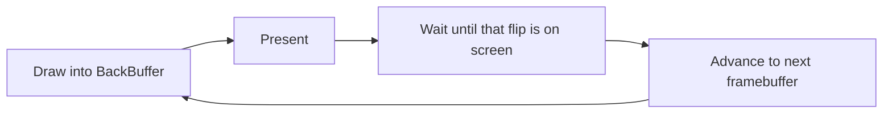

# Graphics

The 2D drawing layer opens the main output, hands you a framebuffer each frame, and gives a `Surface`
of shapes, text, sprites and image effects to draw into it — no shader compiler and no command buffers.
Everything on this page lives in `SharpProspero.Graphics`. When you need a movable, tiled scene or the
lower graphics-processor interface, see the child pages [2D scenes](graphics-scene.md) and
[GPU command layer](graphics-gpu.md).

<details open markdown="block">
  <summary>On this page</summary>
  {: .text-delta }
- TOC
{:toc}
</details>

## The display

`DisplayDevice` opens the main output, allocates its framebuffers from direct memory, registers them,
and presents frames, holding each until the output reports it on screen.

```csharp
using var display = DisplayDevice.Open(width: 1920, height: 1080, bufferCount: 2);
while (running)
{
    Surface surface = display.BackBuffer;
    surface.Clear(Color.Black);
    surface.DrawTextCentered("Frame", 500, 6, Color.White);
    display.Present();
}
```

`BackBuffer` is the framebuffer to draw the next frame into. `Present` submits it, waits until the
output reports that flip as the one on screen, advances to the next framebuffer, and returns the
presented frame index. When the flip queue is full, `Present` retries instead of failing. The default is
a two-buffer swap chain; pass a higher `bufferCount` for triple buffering. The pixels are B8-G8-R8-A8
sRGB. `Open` takes only the sizes the output accepts — 1920x1080, 3840x2160, 720x480, 720x576, or a
width that is a multiple of 32 from 1280 to 1888 with a height of nine sixteenths of it — and throws
`ArgumentOutOfRangeException` for anything else. Only 1920x1080 is accepted on every console; the rest
need the console set up for them and are refused when the buffers are registered.

`Open` takes a `tiling` argument. The default, `VideoOutTilingMode.Tiled`, is accepted on any console
and is what the graphics processor draws into; `BackBuffer` is then a row-major surface of its own that
`Present` rearranges into the scan-out buffer, which walks every pixel on the processor. Pass
`VideoOutTilingMode.Linear` to draw straight into the scan-out buffer and skip that pass — the output
accepts it only while "Enhanced Display Buffer Attribute" is on in the machine's debug settings, and
otherwise `Open` throws a `ProsperoException` saying so. `Tiling` reports which layout is in use.

For a caller that records its own flip on the graphics timeline, `OutputHandle`, `CurrentBufferIndex`,
`BackBufferAddress` and `FrameIndex` give the values the command buffer needs, and `AdvanceFrame` waits
for that frame and rotates the swap chain in place of `Present`. `FlipStatus` reports how far the output
has got through the flips submitted to it, and `Present` takes a `VideoOutFlipMode` (vertical sync by
default).



{: .note }
> When an application runs under `ProsperoApp`, the host owns the display and hands `BackBuffer` to each
> frame through `FrameContext.Surface`. You draw; you do not open or present the display yourself. See
> [Application](application.md).

## The surface

`Surface` is a lightweight view over a framebuffer. It holds a pointer and the geometry and allocates
nothing. Coordinates are in pixels with the origin at the top-left, and every operation clips to the
surface bounds.

| Method | Effect |
|---|---|
| `Clear(color)` | Fill the whole surface. |
| `SetPixel(x, y, color)` | Set one pixel; out-of-bounds is ignored. |
| `FillRect(x, y, w, h, color)` | Fill a rectangle, clipped. |
| `HLine(x, y, length, color)` | Draw a horizontal run, clipped. |
| `VLine(x, y, length, color)` | Draw a vertical run, clipped. |
| `DrawLine(x0, y0, x1, y1, color)` | Draw a one-pixel line between two points, clipped. |
| `DrawRect(x, y, w, h, color)` | Draw a one-pixel rectangle outline, clipped. |
| `FillCircle(cx, cy, radius, color)` | Fill a disc, clipped. |
| `DrawCircle(cx, cy, radius, color)` | Draw a one-pixel circle outline, clipped. |
| `Blit(source, x, y)` | Copy another surface onto this one, clipped. |
| `BlitBlended(source, x, y)` | Copy another surface, blending each pixel over the destination by its alpha. |
| `DrawGlyph(c, x, y, scale, color)` | Draw one glyph scaled by an integer factor. |
| `DrawText(text, x, y, scale, color)` | Draw a string left to right. |
| `DrawTextCentered(text, y, scale, color)` | Draw a string centered horizontally. |
| `DrawTextOutlined(text, x, y, scale, fill, outline)` | Draw a string with a one-pixel outline, so it stays readable over a photo or a video frame. |
| `Surface.MeasureText(text, scale)` | Width in pixels the string occupies. Static: call it on the type, not on a surface. |

Fills use a single-pass span write per row, so `Clear` and `FillRect` run as fast as the memory allows.
When a framebuffer's row pitch is wider than the drawn width, construct the surface with a `stride` (in
pixels) so addressing skips the padding while drawing still clips to the width.

### Extended drawing

The same surface carries a full set of shape, gradient and blit calls for finished interface work.

| Method | What it does |
|---|---|
| `Region(x, y, w, h)` | A view over a sub-rectangle; drawing on it clips to the region, so it acts as a clip rectangle or a panel to draw inside. |
| `FillVerticalGradient(x, y, w, h, top, bottom)` | Fill a rectangle with a top-to-bottom color gradient. |
| `FillHorizontalGradient(x, y, w, h, left, right)` | Fill a rectangle with a left-to-right color gradient. |
| `FillRadialGradient(x, y, w, h, center, edge)` | Fill a rectangle with a gradient from the middle out to the corners, for a soft background or a vignette. |
| `FillRoundedRect(x, y, w, h, radius, color)` | Fill a rectangle with rounded corners. |
| `DrawRoundedRect(x, y, w, h, radius, color)` | Draw a rounded-rectangle outline. |
| `DrawLine(x0, y0, x1, y1, color, thickness)` | Draw a line of a given pixel thickness. |
| `FillTriangle(x0, y0, x1, y1, x2, y2, color)` | Fill a triangle. |
| `FillPolygon(points, color)` | Fill a simple polygon (even-odd rule). |
| `DrawTriangle(x0, y0, x1, y1, x2, y2, color)` | Draw a triangle outline. |
| `DrawPolyline(points, color, thickness)` | Draw connected line segments; the run is open, so the ends are not joined. |
| `DrawRectThick(x, y, w, h, thickness, color)` | Draw a rectangle outline of a given thickness, drawn inside the rectangle. |
| `FillEllipse(cx, cy, radiusX, radiusY, color)` | Fill an ellipse. |
| `DrawEllipse(cx, cy, radiusX, radiusY, color)` | Draw a one-pixel ellipse outline. |
| `FillArcRing(cx, cy, innerRadius, outerRadius, start, sweep, color)` | Fill a slice of a ring, measured clockwise from the positive x-axis; a full turn is a complete ring. |
| `FillPie(cx, cy, radius, start, sweep, color)` | Fill a pie slice (a sector of a disc). |
| `DrawArc(cx, cy, radius, start, sweep, color)` | Draw a one-pixel arc; a full turn is a complete circle. |
| `DrawCircleThick(cx, cy, radius, thickness, color)` | Draw a ring: a circle outline of a given thickness, drawn inwards. |
| `FillRectBlended(x, y, w, h, color)` | Fill a rectangle, blending by the color's alpha (a translucent panel); opaque colors fill directly. |
| `FillCircleBlended(cx, cy, radius, color)` | Fill a disc, blending by the color's alpha (a soft dot or glow). |
| `BlitScaled(source, x, y, w, h)` | Copy a surface scaled to a destination rectangle. |
| `BlitScaledBlended(source, x, y, w, h)` | Scaled copy, blending by source alpha. |
| `BlitScaledSmooth(source, x, y, w, h)` | Scaled copy with bilinear sampling, so an enlarged photo stays smooth rather than blocky. |
| `BlitRotated(source, centerX, centerY, angleRadians)` | Copy a surface rotated about its center, blended. |
| `BlitNineSlice(source, x, y, w, h, border)` | Draw a panel image at any size: corners keep their size, edges stretch along their run, the middle stretches both ways. |

`Region` composes: build a themed panel by taking a sub-region and drawing into it with its own local
coordinates. Gradients and rounded rectangles give buttons and panels a finished look without an image,
and the scaled and rotated copies place thumbnails and sprites.

### Text that fits

`TextLayout` fits text to a width: breaking a paragraph into lines, shortening a label that will not
fit, and drawing either one aligned. It measures through an `ITextFont`, so the same layout serves the
built-in text (`BitmapTextFont`) and a loaded outline font (`TrueTypeFont` implements the interface
too).

| Call | What it does |
|---|---|
| `Wrap(font, text, maxWidth)` | Break into lines no wider than the width, splitting at spaces. A line break starts a new line; a word too wide is split rather than overflowing. |
| `MeasureWrapped(font, text, maxWidth)` | The widest line and the total height of the wrapped block. |
| `DrawWrapped(surface, font, text, x, y, width, color, alignment)` | Draw the wrapped block; returns the height it used. |
| `DrawAligned(surface, font, text, x, y, width, color, alignment)` | Draw one line placed left, centre or right within a width. |
| `Truncate(font, text, maxWidth, ellipsis)` | Shorten to fit, ending with the marker when anything was dropped. |

`alignment` is a `TextAlignment` (`Left`, `Center`, `Right`) and defaults to `Left`.

```csharp
ITextFont font = new BitmapTextFont(2);
int used = TextLayout.DrawWrapped(surface, font, description, 40, 100, 600, Color.White);
string name = TextLayout.Truncate(font, longFileName, columnWidth);
```

### Sprite sheets and animation

`SpriteSheet` reads one image as a grid of equal-sized frames — a character's animation, a set of
icons, a tile set — and draws any frame as a sprite. It reads frames as views onto the shared image and
copies nothing, so it allocates nothing of its own. Pair it with a frame counter, or with `Tween` in
`SharpProspero.Animation` (see [animation.md](animation.md)), to drive it.

```csharp
using var pngDec = SystemModule.Load(SystemModuleId.PngDec);
using var strip = PngImage.Decode(PackageFile.ReadAllBytes("/app0/run.png"));
var sheet = new SpriteSheet(strip.AsSurface(), frameWidth: 48, frameHeight: 48);

int frame = (int)(time * 12) % sheet.Count;     // 12 frames a second
sheet.Draw(display.BackBuffer, frame, x, y);    // blended, so a transparent background composites
```

| Member | What it is |
|---|---|
| `Columns`, `Rows`, `Count` | How the frames are arranged and how many there are. |
| `Frame(index)` | A view onto one frame (numbered left to right, then down), to draw however you like. |
| `Draw(dest, index, x, y)` | Draw a frame as a sprite, blended by alpha. |
| `DrawScaled(dest, index, x, y, w, h)` | Draw a frame scaled into a rectangle. |

`AnimatedSprite` plays a run of a sheet's frames over time, so you do not track the frame yourself.
Point it at all of a sheet or a range within one — several animations can share a sheet — set the rate,
advance it each frame, and draw it.

```csharp
var run = new AnimatedSprite(sheet, framesPerSecond: 12, firstFrame: 0, frameCount: 8);
// each frame:
run.Update((float)context.DeltaSeconds);
run.Draw(context.Surface, x, y);
```

`Mode` is a `SpriteMode`: `Loop` (the default), `Once` (stops on the last frame and reports
`IsComplete`) or `PingPong` (runs out and back). `CurrentFrame` is the sheet frame showing, `LocalFrame`
is the frame within the run, and `Reset` returns to the start.

### Image effects

A surface also transforms in place, over its own pixels, so the same calls apply to a decoded image, an
off-screen surface, or the back buffer. Each keeps the alpha channel.

| Method | What it does |
|---|---|
| `Invert()` | Invert the colours (a photo negative). |
| `ToGrayscale()` | Convert to grey by perceived luminance. |
| `AdjustBrightness(delta)` | Add to every channel (negative darkens), clamped. |
| `AdjustContrast(factor)` | Scale contrast around mid-grey (1 leaves it, above 1 raises it). |
| `Tint(color, amount)` | Blend towards a colour for a wash. |
| `FlipHorizontal()` / `FlipVertical()` | Mirror left-to-right or top-to-bottom. |
| `BoxBlur(radius)` | Blur with a box filter of the given radius. |

```csharp
using var photo = BmpImage.Load("/data/photo.bmp");
Surface s = photo.AsSurface();
s.AdjustBrightness(20);
s.BoxBlur(2);
display.BackBuffer.Blit(s, 0, 0);
```

## Images

`PngImage.Decode` reads a PNG into B8-G8-R8-A8 pixels — the same layout the display surface uses — so a
decoded image blits straight onto a framebuffer. Load the decode module first with `SystemModule`
(in `SharpProspero.Modules`; see [modules.md](modules.md)).

```csharp
using var pngDec = SystemModule.Load(SystemModuleId.PngDec);
byte[] bytes = PackageFile.ReadAllBytes("/app0/assets/logo.png");
using var logo = PngImage.Decode(bytes);
display.BackBuffer.Blit(logo.AsSurface(), x: 100, y: 100);
```

`Decode` parses the header, decodes into a fresh buffer, and releases its decoder. `AsSurface` views the
decoded pixels for drawing; disposing the image frees them. A decoded image carries its alpha channel,
so `BlitBlended` draws it over the background as a sprite while `Blit` copies it opaquely. `JpegImage`
decodes JPEG the same way (load `SystemModuleId.JpegDec`).

`BmpImage` reads BMP and `BmpEncoder` writes it with no system module. The decoder reads the full range
of BMP forms — 1-, 4- and 8-bit palettized, 16-bit (5-5-5 and 5-6-5), 24- and 32-bit, the bit-field and
run-length (RLE8/RLE4) compressions, and both top-down and bottom-up rows — so it is a dependable
interchange format for a file browser or an editor, and a fallback when no decode module is loaded.

```csharp
using var picture = BmpImage.Load("/data/picture.bmp");   // any common BMP form
display.BackBuffer.Blit(picture.AsSurface(), 0, 0);

BmpEncoder.Save(display.BackBuffer, "/data/shot.bmp");     // export a 24-bit BMP
```

`TgaImage` and `TgaEncoder` read and write TGA, a simple lossless format that editors and asset
pipelines export, again with no module. The decoder reads true-colour (15-, 16-, 24- and 32-bit),
colour-mapped and grayscale images, uncompressed or run-length-encoded, with the origin in any corner;
unlike BMP it keeps a proper alpha channel.

```csharp
using var texture = TgaImage.Load("/app0/texture.tga");     // true-colour, indexed or grayscale; plain or RLE
display.BackBuffer.BlitBlended(texture.AsSurface(), x, y);

TgaEncoder.Save(display.BackBuffer, "/data/shot.tga");      // export 32-bit BGRA
```

`GifImage.Decode` reads GIF — static or animated — with no system module, so an interface can show an
animated icon or a spinner. It handles the common forms (GIF87a and GIF89a, global and local colour
tables, interlacing, transparency, and the frame-disposal methods) and returns fully-composed frames,
each with the delay to show it, so an animation is just the frames drawn in order.

```csharp
using var gif = GifImage.Decode(PackageFile.ReadAllBytes("/app0/assets/spinner.gif"));
GifFrame frame = gif.Frames[frameIndex % gif.Frames.Count];
display.BackBuffer.BlitBlended(frame.AsSurface(), x, y);
```

Each `GifFrame` exposes `AsSurface` and `DelayMilliseconds`; the composed pixels carry transparency as an
alpha of zero, so `BlitBlended` overlays a frame while `Blit` copies it opaquely. `LoopCount` reports how
many times the animation repeats (0 for forever), and `First` is the only frame of a still GIF.

`GifEncoder` writes GIF, also with no module: `Encode`/`Save` write a still from a surface, and
`EncodeAnimation`/`SaveAnimation` write an animation from a list of `GifFrameSource` (each a surface with
a delay and a disposal method), with an optional loop count. It builds a colour table from the pixels,
quantizing to 256 colours when an image has more, and carries a fully transparent pixel through as the
GIF transparent index.

```csharp
GifEncoder.Save(display.BackBuffer, "/data/capture.gif");
GifEncoder.SaveAnimation(
    [new GifFrameSource(frame0, delayMilliseconds: 100), new GifFrameSource(frame1, 100)],
    "/data/loop.gif", loopCount: 0);
```

## Off-screen buffers

`PixelBuffer` is a drawing surface of its own, off the screen: its pixels live in memory it owns, in the
same layout as the display. Draw into it as you would the back buffer, then blit it onto the screen. Use
it to build an image once and draw it many times (a pre-rendered sprite, a cached panel), to compose a
picture before showing it, or to build something to encode. It starts fully transparent, so a frame
drawn onto it with alpha composites cleanly.

```csharp
using var cache = new PixelBuffer(256, 64);
Surface s = cache.AsSurface();
s.FillRoundedRect(0, 0, 256, 64, 12, theme.Panel);
s.DrawText("Ready", 16, 20, 3, Color.White);

// later, every frame — no redrawing the panel:
display.BackBuffer.BlitBlended(cache.AsSurface(), x, y);
```

Its `AsSurface` view is valid only while the buffer is alive, so dispose the buffer when you are done.

## Color, gradients and palettes

`Color` packs a pixel for the display format. In memory the bytes run blue, green, red, alpha; the
`A`, `R`, `G` and `B` properties read the channels back.

```csharp
Color background = Color.FromRgb(0x0E, 0x11, 0x16);
Color translucent = Color.FromArgb(0x80, 0xFF, 0x00, 0x00);
Color midway = Color.Lerp(Color.Black, Color.White, 0.5f);              // blend between two colors
Color rainbow = Color.FromHsv(context.TotalSeconds * 60 % 360, 1f, 1f); // hue over time
```

`Lerp` blends component-wise with the factor clamped to 0-1. `FromHsv` builds an opaque color from a
hue in degrees (wrapped) and a saturation and value in 0-1, and `ToHsv` reads them back for a color
picker or a hue shift. `FromHsl` and `ToHsl` do the same over hue, saturation and lightness, where
lightness runs black at 0 through the pure hue at 0.5 to white at 1 — often the easier space for
picking even tints and shades. `Darken` and `Lighten` move a color toward black or white while keeping its
alpha, for a pressed or hovered shade. `WithAlpha` keeps the red, green and blue and sets a new alpha,
which `BlitBlended` then composites. `Black`, `White`, `Red`, `Green`, `Blue` and `Transparent` are
ready to use.

Where the surface's gradient fills blend two colors, a `Gradient` holds as many `GradientStop` entries
as you like and returns the color at any point along it — a heat ramp, a UI theme, a spectrum. A
`Palette` is a fixed set of colors addressed by index, which a gradient can fill by even sampling.

```csharp
Color hot = Gradient.Heat.Sample(load);            // 0..1 along black-red-yellow-white
var ramp = Gradient.Rainbow.ToPalette(16);         // 16 evenly sampled colors
Color series = ramp.Cycle(seriesIndex);            // wraps for a color-per-series scheme
```

`Gradient` sorts its stops, clamps the sample to 0-1, and blends the surrounding stops; `TwoColor` makes
a simple start-to-end ramp, and `Heat` and `Rainbow` are ready-made. `Palette` offers an index
(bounds-checked), `Cycle` (wraps any index), and `Sample` (maps 0-1 to the nearest entry).

## Fonts

`BitmapFont` carries an 8x8 monospaced font for printable ASCII (0x20-0x7F) as read-only data.
`GetGlyph(c)` returns the eight rows for a character; anything outside the range maps to the blank space
glyph, and bit 0 of a row is the leftmost column. This is what `Surface.DrawText` and `BitmapTextFont`
draw, scaled by an integer factor. It needs no file and no module, which makes it the ready choice for a
tool or an overlay.

For smooth text at any size, `TrueTypeFont` loads a `.ttf` or `.otf` file and renders antialiased glyphs
in any color. Load the font modules first, load a font from its bytes, set the pixel size, and draw.
`(x, y)` is the top-left of the line, the same as every other font here, so the layout helpers place
both alike; `DrawTextOnBaseline` takes the baseline instead. Dispose the font when done.

```csharp
using var module = SystemModule.Load(SystemModuleId.Font);
using var backend = SystemModule.Load(SystemModuleId.FontFt);

byte[] ttf = FileSystem.ReadAllBytes("/app0/assets/font.otf");
using var font = TrueTypeFont.Load(ttf, pixelSize: 32);

font.DrawText(surface, "Hello, world", 100, 200, Color.White);
int width = font.MeasureText("Hello, world");
```

`PixelSize` is settable, so one loaded font can be re-sized between draws; sizes below 1 or above 1024
pixels are pulled into that range. Setting it moves both the rasterizer scale and the layout scale
together, so `LineHeight` (the distance from one line to the next) and `BaselineOffset` (the distance
from the top of a line down to its baseline) track the size. `DrawText` adds `BaselineOffset` for you,
which is how it takes a line top where `DrawTextOnBaseline` takes a baseline. Measuring and drawing both
step the pen through the same advance, including the kerning between each pair of glyphs, so a measured
width and a drawn line always agree.

To draw with one of the built-in fonts already on the console, with no font file of your own, open a
`SystemFont` instead. It covers Latin, Japanese, Chinese, Korean, Arabic, Thai and more depending on the
set chosen from `SceFontSet`; the default is a standard European face. It presents the same surface as
`TrueTypeFont`.

```csharp
using var font = SystemFont.Open(SceFontSet.StdEuropeanW1G, pixelSize: 32);
font.DrawText(surface, "Hello, world", 100, 200, Color.White);
```

Both `TrueTypeFont` and `SystemFont` derive from `ScalableFont` and can synthesize weight and slant for a
face that ships without a bold or italic: `SetSlant(ratio)` leans the glyphs (a small positive ratio such
as 0.2 gives a faux italic) and `SetWeight(x, y)` thickens them (a faux bold). Both apply to measuring and
drawing alike.

`TrueTypeFont`, `SystemFont` and `BitmapTextFont` — the built-in glyphs wrapped as a font,
`new BitmapTextFont(scale)` — all implement `ITextFont` (`LineHeight`, `MeasureText`, `DrawText`), so
`TextLayout` and the interface controls work the same whichever one you choose. `BitmapFont` itself is
only the glyph table `BitmapTextFont` draws from.

## Screenshots and photo export

A drawing surface encodes to a file for a screenshot or an export. PNG is lossless and best for
interface captures; JPEG is far smaller and best for photographic content. Load the encode module first.

```csharp
using var pngEnc = SystemModule.Load(SystemModuleId.PngEnc);
PngEncoder.Save(surface, "/data/screenshot.png");

using var jpegEnc = SystemModule.Load(SystemModuleId.JpegEnc);
JpegEncoder.Save(surface, "/data/photo.jpg", quality: 90);   // quality 1..100
```

Both also return the encoded bytes directly — `PngEncoder.Encode(surface)` and
`JpegEncoder.Encode(surface)` — for sending over the network or storing elsewhere. The JPEG encoder
takes a `JpegSampling`: `Ycc420` (the default, smallest), `Ycc422` (more chroma detail), or `Grayscale`
(luminance only). On the way in, `JpegImage.Decode` applies the EXIF orientation tag, so a photo that
records a rotation decodes upright. This captures only what the application itself drew; to capture the
finished screen together with the system overlays, see [Content and capture](content-capture.md).

## Next

- [2D scenes](graphics-scene.md) — a camera, tile maps, particles and grid pathfinding built on this surface.
- [GPU command layer](graphics-gpu.md) — the lower graphics-processor interface, for shader-based rendering.
