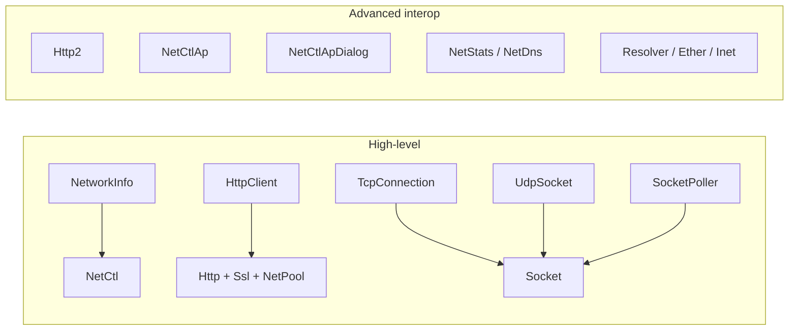

# Network bindings

`SharpProspero.Interop.Net` holds the low-level surface the higher-level types on
[Networking](networking.md) sit on. Reach for it when a job needs something the friendly wrappers do
not cover: HTTP/2, hosting a wireless access point so a phone can join the console, IPv6, per-socket
counters, DNS-cache control, scatter/gather I/O, or the HTTP client's cookie box and epoll multiplexer.



Each binding here is a `[LibraryImport]` class of blittable methods, plus the enums, structures and
constants that go with the service. The rules that govern how a binding is shaped — direct P/Invoke,
blittable parameters, `StringMarshalling.Utf8` for a NUL-terminated string, exact-layout structures —
are covered on the [Bindings](bindings.md) page and apply to every entry point below.

<details open markdown="block">
  <summary>On this page</summary>
  {: .text-delta }
- TOC
{:toc}
</details>

## Hosting a wireless access point

`NetCtlAp` (library `libSceNetCtlAp`, hosted by `libSceNetCtl.prx`) controls the softAP the console
brings up on its own wireless interface so a client can associate to the box directly. The startup
walk goes through the on-screen dialog in [`NetCtlApDialog`](#the-access-point-dialog); once the
runtime says the access point is running the bindings here read back its own state, the credentials
a joiner must present, and callbacks fire as the state changes.

The type surface is short. `NetCtlApState` is where the access point is in its softAP lifecycle:
`Stopped`, `Waiting`, `ApStarting`, `LanSetting` and `Started`. `SceNetCtlApInfo` (152 bytes) is the
readout for the running access point — BSSID, thirty-three-byte NUL-terminated SSID, wireless
channel, security kind, DHCP state, and the sixteen-byte NUL-terminated IPv4 address and netmask the
service is handing out. `SceNetCtlApConnectInfo` (184 bytes) is the credential block a joiner sees:
the SSID, the security kind, and the sixty-five-byte NUL-terminated pre-shared key.

The wireless security kinds `WifiSecurity` names in either block are `WifiSecurityNoAuth`,
`WifiSecurityWep`, `WifiSecurityWpaPskTkip`, `WifiSecurityWpaPskAes`, `WifiSecurityWpa2PskTkip`,
`WifiSecurityWpa2PskAes`, `WifiSecurityWpa3Sae` and `WifiSecurityWpa2Wpa3`.

```csharp
using SharpProspero.Interop.Net;

// Bring the control service up (the dialog brings the access point up itself).
SceResult.ThrowIfFailed(NetCtlAp.sceNetCtlApInit(), nameof(NetCtlAp.sceNetCtlApInit));

int state = 0;
SceResult.ThrowIfFailed(NetCtlAp.sceNetCtlApGetState(&state), nameof(NetCtlAp.sceNetCtlApGetState));
if ((NetCtlApState)state == NetCtlApState.Started)
{
    var info = new SceNetCtlApInfo { Size = (nuint)NetCtlAp.InfoSize };
    SceResult.ThrowIfFailed(NetCtlAp.sceNetCtlApGetInfo(&info),
        nameof(NetCtlAp.sceNetCtlApGetInfo));
    // info.Ssid, info.Channel, info.WifiSecurity and info.IpAddress hold the running access point.

    var creds = new SceNetCtlApConnectInfo { Size = (nuint)NetCtlAp.ConnectInfoSize };
    byte* optStr = stackalloc byte[NetCtlAp.OptStrLen + 1];  // NUL-terminated, up to 8 characters
    SceResult.ThrowIfFailed(NetCtlAp.sceNetCtlApGetConnectInfo(optStr, &creds),
        nameof(NetCtlAp.sceNetCtlApGetConnectInfo));
    // creds.Ssid and creds.WifiSecurityKey hold what a joining client must present.
}
```

| Call | What it does |
|---|---|
| `sceNetCtlApInit`, `sceNetCtlApTerm` | Start and stop the control service. |
| `sceNetCtlApGetState(int* state)` | Read the current lifecycle state as a `NetCtlApState`. |
| `sceNetCtlApGetInfo(SceNetCtlApInfo*)` | Read the running access point's own settings; the caller writes `InfoSize` into the `.Size` field before the call. |
| `sceNetCtlApGetConnectInfo(byte* optStr, SceNetCtlApConnectInfo*)` | Read the credentials a client must present. The caller writes `ConnectInfoSize` into the `.Size` field. |
| `sceNetCtlApStop` | Tear the running access point down. |
| `sceNetCtlApRegisterCallback`, `sceNetCtlApUnregisterCallback` | Register or drop a callback that fires when the state changes. |
| `sceNetCtlApCheckCallback` | Deliver any pending events to the callbacks registered on this thread. |
| `sceNetCtlApGetResult(int eventType, int* errorCode)` | Read the error code that accompanied the most recent event of the given type; called inside a callback body to learn why the state moved. |
| `sceNetCtlApClearEvent(int eventType)` | Clear the last-known result the runtime holds for that event type. |

Callbacks fire from the thread that runs `sceNetCtlApCheckCallback`, so the application drives the
check itself — a poll each frame from the frame loop is the usual choice.

The event kinds a callback receives are named by the `EventType*` constants:
`EventTypeStopped`, `EventTypeStartReqFinished`, `EventTypeStopReqFinished` and `EventTypeStarted`.
`CallbackMax` (8) caps how many callbacks may be registered at once, and `InvalidCid` (-1) is the
value the runtime writes into a slot that has not been claimed.

`ErrorNotStarted`, `ErrorInvalidType`, `ErrorInvalidAddr`, `ErrorChannelConflict`, `ErrorStopReq`,
`ErrorNotInitialized`, `ErrorCallbackMax`, `ErrorInvalidId`, `ErrorIdNotFound`, `ErrorInvalidSize`,
`ErrorInvalidOptStr`, `ErrorAppProcessSuspend`, `ErrorIpAddrConflict` and `ErrorFreqBandConflict`
cover the negative return codes the runtime uses.

### The access point dialog

`NetCtlApDialog` (library `libSceNetCtlApDialog`) rides on the common dialog subsystem, so
`CommonDialog.sceCommonDialogInitialize` from [`SharpProspero.Interop.Dialog`](dialogs.md) is what
comes first. Fill `SceNetCtlApDialogParam` through the `InitializeParam` helper — it zeroes the
block, writes the size fields and the check value the service requires — then set `Mode` (only
`Connect` is defined today) and `OptStr` before the open call.

```csharp
using SharpProspero.Interop.Dialog;
using SharpProspero.Interop.Net;

SceResult.ThrowIfFailed(NetCtlApDialog.sceNetCtlApDialogInitialize(),
    nameof(NetCtlApDialog.sceNetCtlApDialogInitialize));
try
{
    var param = default(SceNetCtlApDialogParam);
    NetCtlApDialog.InitializeParam(&param);
    SceResult.ThrowIfFailed(NetCtlApDialog.sceNetCtlApDialogOpen(&param),
        nameof(NetCtlApDialog.sceNetCtlApDialogOpen));

    // Pump the dialog until it finishes; a frame loop runs UpdateStatus once per frame.
    CommonDialogStatus status;
    do { status = NetCtlApDialog.sceNetCtlApDialogUpdateStatus(); }
    while (status != CommonDialogStatus.Finished);

    var result = default(SceNetCtlApDialogResult);
    SceResult.ThrowIfFailed(NetCtlApDialog.sceNetCtlApDialogGetResult(&result),
        nameof(NetCtlApDialog.sceNetCtlApDialogGetResult));
}
finally
{
    NetCtlApDialog.sceNetCtlApDialogTerminate();
}
```

| Call | What it does |
|---|---|
| `sceNetCtlApDialogInitialize`, `sceNetCtlApDialogTerminate` | Bring the dialog subsystem's access-point flow up and down. |
| `InitializeParam(SceNetCtlApDialogParam*)` | Zero the block, write the sizes plus the check value, and set `Mode` to `Connect`; the caller then sets `OptStr` if a non-default set is wanted. |
| `sceNetCtlApDialogOpen(SceNetCtlApDialogParam*)` | Open the dialog. |
| `sceNetCtlApDialogClose` | Close an open dialog before it finishes on its own. |
| `sceNetCtlApDialogUpdateStatus` / `sceNetCtlApDialogGetStatus` | Advance the dialog and return its `CommonDialogStatus`; the second returns the same value without advancing. |
| `sceNetCtlApDialogGetResult(SceNetCtlApDialogResult*)` | Read the result of a finished dialog. |

`NetCtlApDialogMode` names the mode set on the parameter block (only `Connect` at present).
`OptStrLen` (8) is the longest option string the block accepts; `ErrorInternal` is the failure code
the runtime returns for an internal error such as a network fault.

## HTTP/2

`Http2` (library `libSceHttp2`) is the HTTP/2 client. The bindings cover the request layer end-to-end
— create request, send, read status and body, add or remove headers, follow or intercept redirects,
manage cookies in their own boxes, and hand authentication or Set-Cookie decisions to a callback.
The service init and template create sit in the linker's stub catalog so an application that needs
them adds its own `[LibraryImport]` declarations under `libSceHttp2`; the request-time entries
already published from managed code are the surface below.

```csharp
using SharpProspero.Interop.Net;

// tmplId is a template id the caller created (sceHttp2CreateTemplate is in the stub catalog;
// declare it locally with [LibraryImport("libSceHttp2")] where the app needs it).
int reqId = Http2.sceHttp2CreateRequestWithURL(tmplId, "GET", "https://example.com/", 0);
try
{
    SceResult.ThrowIfFailed(Http2.sceHttp2SendRequest(reqId, null, 0),
        nameof(Http2.sceHttp2SendRequest));

    int status = 0;
    SceResult.ThrowIfFailed(Http2.sceHttp2GetStatusCode(reqId, &status),
        nameof(Http2.sceHttp2GetStatusCode));

    byte* buffer = stackalloc byte[4096];
    int read;
    while ((read = Http2.sceHttp2ReadData(reqId, buffer, (nuint)4096)) > 0)
        Consume(new ReadOnlySpan<byte>(buffer, read));
}
finally
{
    Http2.sceHttp2AbortRequest(reqId);  // release the request-side state
}
```

| Area | Calls |
|---|---|
| Request lifecycle | `sceHttp2CreateRequestWithURL`, `sceHttp2SendRequest`, `sceHttp2AbortRequest`, `sceHttp2ReadData`, `sceHttp2GetStatusCode`, `sceHttp2GetResponseContentLength`, `sceHttp2SetRequestContentLength` |
| Headers | `sceHttp2AddRequestHeader`, `sceHttp2RemoveRequestHeader`, `sceHttp2GetAllResponseHeaders` |
| Timeout and transport | `sceHttp2SetConnectTimeOut`, `sceHttp2SetInflateGZIPEnabled` |
| Cookies (box life and I/O) | `sceHttp2CreateCookieBox`, `sceHttp2DeleteCookieBox`, `sceHttp2AddCookie`, `sceHttp2GetCookie`, `sceHttp2CookieImport`, `sceHttp2CookieExport`, `sceHttp2CookieFlush`, `sceHttp2GetCookieStats`, `sceHttp2SetCookieMaxNum`, `sceHttp2SetCookieMaxNumPerDomain`, `sceHttp2SetCookieMaxSize` |
| Callbacks | `sceHttp2SetCookieRecvCallback`, `sceHttp2SetCookieSendCallback`, `sceHttp2SetRedirectCallback`, `sceHttp2SetAuthEnabled`, `sceHttp2SetAuthInfoCallback` |
| Cache flush | `sceHttp2AuthCacheFlush`, `sceHttp2RedirectCacheFlush` |
| Accounting | `sceHttp2GetMemoryPoolStats` |

`SceHttp2HttpVersion` names the HTTP version a template negotiates for: `Http10`, `Http11`, `Http20`.
`SceHttp2AddHeaderMode` picks the behaviour of `sceHttp2AddRequestHeader` when a header of the same
name already exists: `Overwrite` replaces it, `Add` appends. `SceHttp2AuthType` is the challenge the
authentication callback receives — `Basic`, `Digest`, and three reserved values. `SceHttp2ContentLengthType`
reports what `sceHttp2GetResponseContentLength` filled in: `Exist` when the response carries a
Content-Length header, `NotFound` when it does not, `ChunkEncoded` when the body is chunked.

`SceHttp2MemoryPoolStats` and `SceHttp2CookieStats` are the layouts the two accounting calls fill.

The library's own limit and default constants live on the class: `CookiePoolSizeMin` (64 KiB, the
lowest cookie-pool size the service accepts), the microsecond defaults `DefaultKeepaliveTimeout`
(7 s), `DefaultTimeout` (120 s), `DefaultConnectTimeout` (30 s), `DefaultSendTimeout` (120 s) and
`DefaultRecvTimeout` (120 s), `DefaultRecvBlockSize` (2 KiB), the redirect and auth caps
`DefaultRedirectMax` (6) and `DefaultTryAuthMax` (6), and `FixedHttp1ResponseHeaderMax` (64 KiB, the
cap on a fixed HTTP/1.x response header block). The TLS flags — `SslFlagServerVerify`, `SslFlagCnCheck`,
`SslFlagNotAfterCheck`, `SslFlagNotBeforeCheck` and `SslFlagKnownCaCheck` — mirror the ones on
`Http.SslFlag*`, so an app enabling verification on a template and on the request itself uses the
same bit patterns for both.

{: .note }
> `sceHttp2SetAuthInfoCallback`, `sceHttp2SetRedirectCallback`, `sceHttp2SetCookieRecvCallback` and
> `sceHttp2SetCookieSendCallback` take function pointers with the `Cdecl` calling convention, so mark
> the callback method `[UnmanagedCallersOnly(CallConvs = [typeof(CallConvCdecl)])]` and give it the
> signature the class exposes for that entry.

## Access-point-aware HTTP client

`HttpClient` (the high-level type on [Networking](networking.md)) brings up `libSceNet`, `libSceSsl`
and `libSceHttp` through `Sysmodule.sceSysmoduleLoadModuleInternal` first, then calls `sceNetInit`
before `sceNetPoolCreate`, then `sceSslInit`, then `sceHttpInit`, then `sceHttpCreateTemplate`. It
installs a per-template callback through `sceHttpsSetSslCallback` that returns zero for every chain,
so a public host whose certificate is issued by a CA the built-in store does not carry still reaches
the transport layer. Response payloads are checked at the HTTP layer through the status code and
content length, not through the certificate chain.

The extra `Http` (`libSceHttp`) surface underneath that client is available for advanced HTTP work:

| Area | Calls |
|---|---|
| URI parsing and building | `sceHttpUriParse`, `sceHttpUriBuild`, `sceHttpUriMerge`, `sceHttpUriEscape`, `sceHttpUriUnescape`, `sceHttpUriSweepPath` |
| Cookies (jar I/O and stats) | `sceHttpAddCookie`, `sceHttpGetCookie`, `sceHttpCookieExport`, `sceHttpCookieImport`, `sceHttpCookieFlush`, `sceHttpGetCookieStats`, `sceHttpGetCookieEnabled` |
| Authentication and redirect caches | `sceHttpAuthCacheFlush`, `sceHttpRedirectCacheFlush`, `sceHttpGetAuthEnabled` |
| Alternate connection and request forms | `sceHttpCreateConnection(tmplId, serverName, scheme, port, keepAlive)`, `sceHttpCreateRequest(connId, method, path, contentLength)`, `sceHttpCreateRequest2(connId, method, path, contentLength)` |
| Epoll multiplexer | `sceHttpCreateEpoll`, `sceHttpDestroyEpoll`, `sceHttpGetEpoll`, `sceHttpAbortWaitRequest` |
| Accounting | `sceHttpGetMemoryPoolStats` |

`SceHttpUriElement` is the URL broken into scheme, user name, password, host, path, query, fragment
and port, plus an `Opaque` flag set when only `Path` is meaningful. The strings point into the pool
handed to `sceHttpUriParse`, so anything a caller wants past the pool's lifetime is copied out
first. `Http.UriBuildWith*` flags pick which parts `sceHttpUriBuild` writes into the output URL, or
`Http.UriBuildWithAll` for every part that is present. `MaxUriLength` is the longest URL the URI
helpers accept, excluding the terminator (16 KiB minus one).

`SceHttpMemoryPoolStats` and `SceHttpCookieStats` are the layouts the two accounting calls fill.

## Wider network status

`NetCtl` (library `libSceNetCtl`) is what `NetworkInfo` reads through. Alongside the IPv4 fields
[Networking](networking.md#network-information) covers, the class also carries IPv6, interface byte
counters, and the address-translation state the box sees:

| Call | What it does |
|---|---|
| `sceNetCtlGetStateV6(int* state)` | Read the IPv6 connection state. |
| `sceNetCtlGetInfoV6(int code, SceNetCtlInfoV6*)` | Read one fact about the IPv6 connection into a 256-byte union whose requested member sits at offset zero. The codes are `InfoV6IpAddress`, `InfoV6LinkLocalAddress`, `InfoV6DefaultRoute`, `InfoV6PrimaryDns`, `InfoV6SecondaryDns`. |
| `sceNetCtlGetResultV6(int eventType, int* errorCode)` | Read the error code that accompanies the most recent IPv6 callback event. |
| `sceNetCtlGetIfStat(SceNetCtlIfStat*)` | Read the byte counters and device kind for the currently selected interface. |
| `sceNetCtlGetNatInfo(SceNetCtlNatInfo*)` | Read the address-translation state: STUN outcome, NAT type, and mapped address. |

`SceNetCtlIpv6Addr` carries a forty-six-byte NUL-terminated IPv6 address string and a one-to-128
prefix length. `SceNetCtlInfoV6` is the 256-byte read-back union `sceNetCtlGetInfoV6` fills.
`SceNetCtlIfStat` is fifty-six bytes: a device word, four bytes of padding, `TxBytes`, `RxBytes`,
then a thirty-two-byte reserved region. `SceNetCtlNatInfo` reports `StunStatus`
(`NatInfoStunUnchecked`, `NatInfoStunFailed`, `NatInfoStunOk`), `NatType` (`NatInfoNatType1`,
`NatInfoNatType2`, `NatInfoNatType3`) and `MappedAddr`, the address the router presents on the
outside.

`V6CallbackMax` (8) caps how many IPv6 callbacks may be registered at once.

## Raw sockets: extras

The high-level connection and listener wrappers on [Networking](networking.md) cover the IPv4
connection path. The `Socket` (library `libSceNet`) bindings underneath them also carry:

| Call | What it does |
|---|---|
| `sceNetGetSockInfo(int s, SceNetSockInfo*, int n, int flags)` | Read one or more per-socket detail entries for an IPv4 socket. |
| `sceNetGetSockInfo6(int s, SceNetSockInfo6*, int n, int flags)` | Read the same for a socket that may hold an IPv4 or an IPv6 endpoint; the layout carries the IPv6 addresses in place. |
| `sceNetSendmsg`, `sceNetRecvmsg(int s, SceNetMsghdr*, int flags)` | Send or receive a scatter/gather message; the header points at an `SceNetIovec` list. |
| `sceNetSocketAbort(int s, int flags)` | Cancel a blocking call on a socket so it can be closed promptly. The flags are `SocketAbortFlagRcvPreservation`, `SocketAbortFlagSndPreservation` and `SocketAbortFlagSndPreservationAgain`. |
| `sceNetEpollAbort(int eid, int flags)` | Unblock a thread waiting in the poller so a server can shut down cleanly — what `SocketPoller.Abort` calls into. |
| `sceNetErrnoLoc()` | Return the per-thread error pointer read after a socket call fails. |

`SceNetSockInfo` and `SceNetSockInfo6` carry the debug name, owning process id, socket type, policy
and priority, receive- and send-queue lengths, local and remote endpoints, port and virtual-port
pairs, connection state (the `SockInfoState*` constants), status bits (the `SockInfoF*` constants),
throughput and buffer sizes, and drop counters. The status flag `SockInfoFIpv6` on `SockInfo6`
distinguishes an IPv6 endpoint from an IPv4 one. `SockInfoTimeWait` on `sceNetGetSockInfo` also
lists sockets in the TIME_WAIT state; `SockInfo6Ipv46` on `sceNetGetSockInfo6` reports both address
families.

The `SockStreamP2p` and `SockDgramP2p` socket types open a peer-to-peer stream or datagram socket
alongside the ordinary `SockStream` and `SockDgram`.

The `SceNetMsghdr` fields are `Name` (an optional address for a datagram) and its `NameLen`, the
`Iov` scatter/gather list of `IovLen` entries, the ancillary-data `Control` pointer and its
`ControlLen`, and the `Flags` the receive path reports back. Each `SceNetIovec` is a `Base` pointer
and its `Length`.

### DNS control

`NetDns` (library `libSceNet`) points the resolver at a chosen server pair or drops what it has
cached:

| Call | What it does |
|---|---|
| `sceNetSetDnsInfo(SceNetDnsInfo*, int flags)` | Set the primary and secondary DNS servers the resolver falls back to. `NetDns.AddrMax` (2) is how many entries `SceNetDnsInfo` carries. |
| `sceNetClearDnsCache(int flags)` | Drop the resolver's DNS cache. |

`SceNetDnsInfo` holds `Primary` and `Secondary`, each a `SceNetInAddr` in network byte order.

### Byte counters and pool accounting

`NetStats` (library `libSceNet`) reports what the interface and the memory pool are doing:

| Call | What it does |
|---|---|
| `sceNetGetInterfaceStats(SceNetInterfaceStats*, int flags)` | Read the byte counters for the active interface. |
| `sceNetGetMemoryPoolStats(int memid, SceNetMemoryPoolStats*)` | Read the current, peak and total sizes of a memory pool. |

`SceNetInterfaceStats` carries `TxBytes` and `RxBytes` since the interface came up.
`SceNetMemoryPoolStats` carries `PoolSize`, `MaxInuseSize` and `CurrentInuseSize`.

### Address helpers

`Ether` and `Inet` (both `libSceNet`) parse and format the fixed-form addresses the socket layer
takes and swap between host and network byte order.

| Class | Calls |
|---|---|
| `Ether` | `sceNetEtherStrton(str, out addr)` and `sceNetEtherNtostr(&addr, str, len)` (colon-separated MAC parse and format), `sceNetGetMacAddress(&addr, flags)` for the interface's own address. Constants: `AddrLen` (6), `AddrStrLen` (18). |
| `Inet` | `sceNetInetNtop(af, src, dst, size)` and `sceNetInetPton(af, src, dst)` (canonical string form for either address family), `sceNetHtonl` / `sceNetHtons` / `sceNetNtohl` / `sceNetNtohs` (byte-order swap). Constant: `InetAddrStrLen` (16). |

### The resolver's connect helper

`Resolver.sceNetResolverConnect(SceNetResolverConnectInfo*, hostname, port, SceNetResolverConnectParam*)`
turns a host name straight into a connected socket. The caller allocates
`SceNetResolverConnectInfo` (a state block that holds the resolved-name records, the two sockets the
helper opened, the pool it used, and the address it picked from the list) and
`SceNetResolverConnectParam` (the connect and name-resolution timeouts in microseconds, the retry
count and a flags word), and the helper walks both address families to return a socket already
connected. Alongside it, the IPv6-aware resolver entries are `sceNetResolverStartNtoa6` and
`sceNetResolverStartAton6`, and `sceNetResolverAbort` cancels any blocking lookup so the resolver
can be closed promptly. `Resolver.AbortFlagNtoaPreservation` and `AbortFlagAtonPreservation` keep
the matching pending lookup across the abort.

`SceNetResolverInfoEx` carries up to ten `SceNetResolverAddrEx` records tagged with their address
family (`Socket.AfInet` or `Socket.AfInet6`), plus counts of how many are IPv4, IPv6 and the total.

## Result codes and error handling

Each binding here returns a 32-bit result on the same rule as the rest of the bindings: non-negative
is success; negative is an error. `SceResult.ThrowIfFailed` on [Bindings](bindings.md#result-codes)
raises a `ProsperoException` carrying the call name and the raw code. The named error constants on
each class — the `NetCtlAp.Error*` family, `NetCtlApDialog.ErrorInternal`, and the fixed
`Socket.SockInfoStateXxx` and `Socket.SockInfoFXxx` values — cover the codes each service uses.

For the friendly wrappers over the raw sockets, the `libSceHttp` client, and the network-status
readouts, see [Networking](networking.md).
